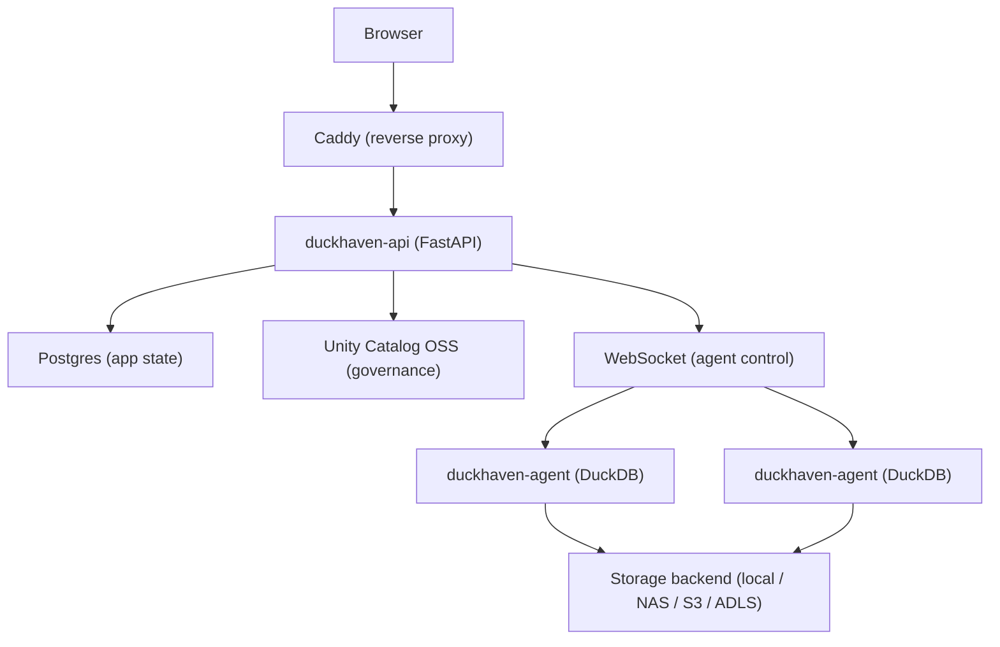

# DuckHaven

> A self-hosted collaborative SQL workspace for DuckDB teams.

[](https://github.com/tmrtn/duckhaven/actions)
[](https://www.python.org/)
[](#license)


## Why DuckHaven

Your team loves DuckDB, but sharing `.duckdb` files across Slack is chaos. You want the worksheet experience of Databricks or Snowflake without the enterprise gravity. You want MotherDuck collaboration without the cloud lock-in.

DuckHaven is a self-hosted analytics workspace that lets teams write, share, and govern SQL queries over DuckDB. It combines browser-based worksheets with Unity Catalog governance — lightweight enough for a homelab, serious enough for a team.

**Analytics without enterprise gravity.** No cloud warehouse lock-in. No Kubernetes. No opaque billing. No platform team required. Just DuckDB, for teams.

## What You Get

- **Browser-Based Worksheets** — Monaco SQL editor with tabs, results grid, and CSV export. Write queries together without emailing SQL snippets.
- **Shared Catalog** — Browse schemas and tables with sample rows. Every table is Delta-native with Catalog Commits ON.
- **Governed Workspaces** — Per-workspace permissions, Unity Catalog integration, and a full audit trail of who ran what.
- **Transparent Compute** — You pick the DuckDB agent per query. No opaque optimizer, no surprise costs, no hidden resource allocation.
- **Self-Hosted** — Docker Compose on your network. Your data never leaves your infrastructure.
- **Short-Lived Credentials** — Unity Catalog vends temporary storage credentials per query. No long-lived secrets on agents.

## Quickstart

Get DuckHaven running in five minutes:

```bash
git clone https://github.com/tmrtn/duckhaven.git
cd duckhaven
cp deploy/.env.example deploy/.env
# Edit deploy/.env — set POSTGRES_PASSWORD and SECRET_KEY

make install
make compose-up
make migrate
make seed email=you@example.com password=changeme
make dev-web
```

Then open [http://localhost:5173](http://localhost:5173) and log in with the credentials you just seeded.

See [docs/DEPLOYMENT.md](docs/DEPLOYMENT.md) for production deployment and [docs/DEVELOPMENT.md](docs/DEVELOPMENT.md) for local development setup.

## Screenshots

### SQL Worksheet

The primary surface. Write SQL, pick your agent, run queries, and browse results.


### Catalog Browser

Inspect table schemas and preview sample rows without writing a query.


### Agent Management

Register agents, view capabilities, and generate bootstrap tokens from the admin panel.


## Architecture

DuckHaven separates control from compute. The control plane manages users, workspaces, and queries. DuckDB agents connect via WebSocket to execute SQL and return results.



**Key design choices:**

- The control plane does **not** run DuckDB. Compute lives in agent processes that dial home over WebSocket.
- Users pick the executing agent per worksheet — transparent compute, no opaque optimizer.
- Every workspace is bound to exactly one storage backend: local FS, NAS, S3, or Azure.
- Unity Catalog OSS provides table governance and vends short-lived storage credentials per query.
- SQL is allowlisted to `SELECT` and `INSERT` only. DDL runs through UC REST.

For the full architecture, see [docs/ARCHITECTURE.md](docs/ARCHITECTURE.md). For the UI design system, see [docs/UI-DESIGN.md](docs/UI-DESIGN.md).

## DuckHaven vs. Alternatives

| | DuckHaven | MotherDuck | Databricks | Ad hoc DuckDB |
|---|---|---|---|---|
| **Hosting** | Self-hosted | Cloud SaaS | Cloud/Enterprise | Local only |
| **Engine** | DuckDB | DuckDB | Spark/JVM | DuckDB |
| **Collaboration** | Worksheets + catalog + audit | Worksheets + sharing | Worksheets + notebooks | None |
| **Governance** | Unity Catalog OSS | Proprietary | Unity Catalog Enterprise | None |
| **Complexity** | Docker Compose | Zero setup | Kubernetes + platform team | Scripts |
| **Cost model** | Free (self-hosted) | Per-seat SaaS | Enterprise contract | Free |

**When to choose DuckHaven:**

- **Over MotherDuck** — when you need data sovereignty, network privacy, or want to avoid SaaS lock-in.
- **Over Databricks** — when you want collaborative SQL analytics without the megacluster mentality.
- **Over ad hoc DuckDB** — when your team needs query history, saved worksheets, shared catalogs, and permission controls.

## Deployment

The control plane runs as a single Docker Compose stack: Caddy, Postgres, Unity Catalog OSS, and the FastAPI app. Agents are deployed separately — one container per host/VM — and dial home to the control plane over WebSocket.

**Control plane:**

```bash
cp deploy/.env.example deploy/.env
# Set POSTGRES_PASSWORD and SECRET_KEY
make compose-up
make migrate
```

**Agent:**

Generate a bootstrap token in the admin UI, then run the agent container with the token and control-plane URL. See [docs/AGENTS.md](docs/AGENTS.md) for full agent setup.

Tailscale is recommended for network privacy, but any network that lets agents reach the control plane works.

## Repository Structure

| Directory | Contents |
|---|---|
| `web/` | React + TypeScript + Vite frontend |
| `api/` | FastAPI control plane |
| `agent/` | DuckDB compute agent |
| `shared/` | Python types shared by api and agent |
| `deploy/` | Docker Compose stack, Caddyfile, env template |
| `scripts/` | Operator helper scripts |
| `docs/` | Architecture, design, deployment, and development docs |

## Roadmap

- **Shipped (M3)** — SQL worksheets, catalog browser, query dispatch to agents, Unity Catalog integration, workspace permissions, saved queries, audit log, storage backend registry, agent bootstrap tokens.
- **In progress (M4)** — Multi-agent hardening, result retention sweep, UC permission mirroring, server-side backend compatibility checks, agent image publishing, DR automation.
- **Future** — Notebook UI, heterogeneous engines (Spark, Trino, Polars), per-table backend override, control-plane HA, Prometheus metrics + Grafana dashboards.

See [docs/ARCHITECTURE.md](docs/ARCHITECTURE.md) §11 and §16 for the full milestone and gap tracker.

## Contributing

Conventional commits, branch prefixes (`feat/`, `fix/`, `chore/`, `docs/`, `refactor/`, `test/`), and tests for every change. See [CLAUDE.md](CLAUDE.md) for the full development guidelines.

- Frontend: Vitest + React Testing Library + MSW
- Backend: pytest + pytest-asyncio (API ≥80% coverage, agent ≥75% coverage)

## License

MIT. See [LICENSE](LICENSE) for details.
