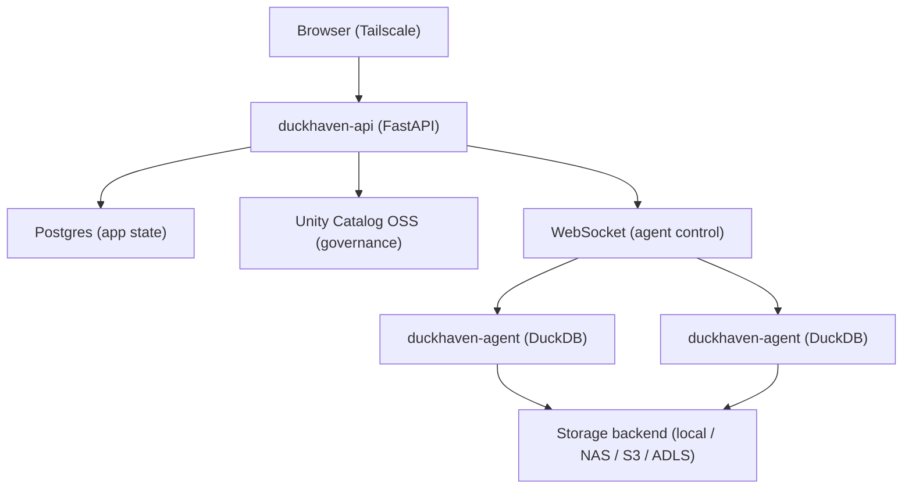

# DuckHaven

> A self-hosted collaborative SQL workspace for DuckDB teams.


Your team loves DuckDB, but sharing `.duckdb` files across Slack is chaos. You want the worksheet experience of Databricks or Snowflake without the enterprise gravity, and MotherDuck-style collaboration without the cloud lock-in.

DuckHaven is a self-hosted analytics workspace that lets teams write, share, and govern SQL queries over DuckDB. It combines browser-based worksheets with Unity Catalog governance — lightweight enough for a homelab, serious enough for a team. No cloud warehouse lock-in, no Kubernetes, no opaque billing, no platform team required.

## Alternatives

DuckHaven is not the only way to run SQL over DuckDB. Pick the tool that fits your constraints:

- **[MotherDuck](https://motherduck.com/)** is managed DuckDB in the cloud, with collaboration and sharing built in. Use it when you want zero operational overhead and are comfortable with a SaaS holding your data.
- **[Databricks](https://www.databricks.com/)** is the enterprise lakehouse — Spark, notebooks, and Unity Catalog Enterprise. Use it when you have a platform team, a Kubernetes budget, and workloads that outgrow a single box.
- **Ad hoc DuckDB** is a `.duckdb` file and a CLI. Use it for solo, throwaway analysis where collaboration, query history, and governance don't matter.

| | DuckHaven | MotherDuck | Databricks | Ad hoc DuckDB |
|---|---|---|---|---|
| **Hosting** | Self-hosted | Cloud SaaS | Cloud/Enterprise | Local only |
| **Engine** | DuckDB | DuckDB | Spark/JVM | DuckDB |
| **Collaboration** | Worksheets + catalog + audit | Worksheets + sharing | Worksheets + notebooks | None |
| **Governance** | Unity Catalog OSS | Proprietary | Unity Catalog Enterprise | None |
| **Complexity** | Docker Compose | Zero setup | Kubernetes + platform team | Scripts |
| **Cost model** | Free (self-hosted) | Per-seat SaaS | Enterprise contract | Free |

**Use DuckHaven instead when** you run a homelab or a small team and want collaborative, governed SQL over DuckDB on your own infrastructure — browser worksheets, a shared catalog, per-workspace permissions, and a full audit trail — with data sovereignty, network privacy, and no SaaS lock-in.

## Features

- **Browser-Based Worksheets** — Monaco SQL editor with tabs, results grid, and CSV export. Write queries together without emailing SQL snippets.
- **Shared Catalog** — Browse schemas and tables with sample rows. Every table is Delta-native with Catalog Commits ON.
- **Governed Workspaces** — Per-workspace permissions, Unity Catalog integration, and a full audit trail of who ran what.
- **Transparent Compute** — You pick the DuckDB agent per query. No opaque optimizer, no surprise costs, no hidden resource allocation.
- **Self-Hosted** — Docker Compose on your network. Your data never leaves your infrastructure.
- **Short-Lived Credentials** — Unity Catalog vends temporary storage credentials per query. No long-lived secrets on agents.

## Screenshots

### SQL Worksheet

The primary surface. Write SQL, pick your agent, run queries, and browse results.


### Catalog Browser

Inspect table schemas and preview sample rows without writing a query.


### Agent Management

Register agents, view capabilities, and generate bootstrap tokens from the admin panel.


## Architecture

DuckHaven separates control from compute. The control plane manages users, workspaces, and queries. DuckDB agents connect via WebSocket to execute SQL and return results.



**Key design choices:**

- The control plane does **not** run DuckDB. Compute lives in agent processes that dial home over WebSocket.
- Users pick the executing agent per worksheet — transparent compute, no opaque optimizer.
- Every workspace is bound to exactly one storage backend: local FS, NAS, S3, or Azure.
- Unity Catalog OSS provides table governance and vends short-lived storage credentials per query.
- SQL is allowlisted to `SELECT` and `INSERT` only. DDL runs through UC REST.
- The API is exposed directly on port 8000 over a private network (Tailscale recommended); there is no public ingress.

For the full architecture, see [docs/ARCHITECTURE.md](docs/ARCHITECTURE.md). For the UI design system, see [docs/UI-DESIGN.md](docs/UI-DESIGN.md).

## Tech Stack

| Layer | Choice |
|---|---|
| Frontend | React 19 + TypeScript + Vite, Monaco SQL editor, TanStack Router/Query/Table, Radix UI + shadcn/ui + Tailwind |
| API / control plane | FastAPI (Python 3.14), async; `websockets` for the agent channel |
| Database | PostgreSQL 16, SQLAlchemy 2.x (async) + Alembic migrations |
| Agent | Python 3.14 embedding DuckDB; small HTTP server for result-range reads |
| Engine | DuckDB ≥ 1.5 — present **only** on agents |
| Catalog | Unity Catalog OSS — catalog + short-lived credential vendor |
| Storage format | Delta Lake, Catalog Commits ON, one backend per workspace |
| Storage backends | Local FS, NAS, S3 (`httpfs`), ADLS Gen 2 (`azure`) |
| Package management | uv (Python workspace), npm (web) |
| Containerisation | Docker Compose (control plane); single container per agent |
| Tests | pytest + pytest-asyncio (api, agent); Vitest + React Testing Library + MSW (web) |

## Getting Started

### Prerequisites

- Docker Engine 24+ and Docker Compose v2
- A Linux host for the control plane (8 GB RAM minimum)
- One or more Linux hosts/VMs for agents (8 GB RAM each)
- (Recommended) Tailscale for a private network mesh

### Control plane

```bash
git clone https://github.com/tamasmrtn/duckhaven.git
cd duckhaven

make compose-up
make compose-migrate
make compose-seed email=you@example.com password=changeme
```

`POSTGRES_PASSWORD` and `SECRET_KEY` are generated on first boot and
persisted to a docker volume — no `.env` editing required. To override
either (e.g. to share a secret across hosts), see [`deploy/.env.example`](deploy/.env.example).

This brings up Postgres, Unity Catalog OSS, and the FastAPI API on port 8000. To explore the UI locally, run `make dev-web` and open [http://localhost:5173](http://localhost:5173); log in with the credentials you just seeded. In a deployment, the API is reachable directly at `http://<control-plane-host>:8000`.

### Agent

Agents run DuckDB and are deployed separately — one container per host/VM. Generate a bootstrap token in the admin UI (Admin → Agents), then run the agent container with the token and the control-plane URL. See [docs/AGENTS.md](docs/AGENTS.md) for full agent setup.

See [docs/DEPLOYMENT.md](docs/DEPLOYMENT.md) for production deployment and [docs/DEVELOPMENT.md](docs/DEVELOPMENT.md) for local development.

## Environment Variables

Every control-plane variable is optional — with no `deploy/.env`, the stack auto-generates persistent secrets on first boot.

| Variable | Default | Description |
|---|---|---|
| `POSTGRES_PASSWORD` | _random, persisted_ | Postgres password. Auto-generated on first boot and stored in the `secrets` volume; set this only to override (e.g. when sharing a value across hosts). |
| `SECRET_KEY` | _random, persisted_ | Session-cookie signing key. Same behaviour as above. |
| `COOKIE_SECURE` | `false` | Set `true` when serving over HTTPS behind a TLS terminator. |
| `DUCKHAVEN_IMAGE_TAG` | `latest` | Image tag pulled from `ghcr.io/tamasmrtn/duckhaven-api`. Pin to a release tag (e.g. `v1.2.3`) for predictable upgrades. |

Agent-side variables (`CONTROL_PLANE_URL`, `BOOTSTRAP_TOKEN`, `RESULTS_DIR`, …) are documented in [docs/AGENTS.md](docs/AGENTS.md).

## Roadmap

- **Shipped (M3)** — SQL worksheets, catalog browser, query dispatch to agents, Unity Catalog integration, workspace permissions, saved queries, audit log, storage backend registry, agent bootstrap tokens.
- **In progress (M4)** — Multi-agent hardening, result retention sweep, UC permission mirroring, server-side backend compatibility checks, agent image publishing, DR automation.
- **Future** — Notebook UI, heterogeneous engines (Spark, Trino, Polars), per-table backend override, control-plane HA, Prometheus metrics + Grafana dashboards.

See [docs/ARCHITECTURE.md](docs/ARCHITECTURE.md) §11 and §16 for the full milestone and gap tracker.

## Contributing

Conventional commits, branch prefixes (`feat/`, `fix/`, `chore/`, `docs/`, `refactor/`, `test/`), and tests for every change. See [CLAUDE.md](CLAUDE.md) for the full development guidelines.

- Frontend: Vitest + React Testing Library + MSW
- Backend: pytest + pytest-asyncio (API ≥80% coverage, agent ≥75% coverage)

### Development Setup

```bash
make install      # uv sync --all-packages + npm install in web/
make dev-api       # FastAPI with hot reload on :8000
make dev-web       # Vite dev server on :5173 (MSW mocks if the API is down)
make test          # API + agent + web tests
make lint          # Ruff + ESLint
make format        # Ruff + Prettier
```

Repository layout:

| Directory | Contents |
|---|---|
| `web/` | React + TypeScript + Vite frontend |
| `api/` | FastAPI control plane |
| `agent/` | DuckDB compute agent |
| `shared/` | Python types shared by api and agent |
| `deploy/` | Docker Compose stack, env template |
| `scripts/` | Operator helper scripts |
| `docs/` | Architecture, design, deployment, and development docs |

## Inspiration

DuckHaven's worksheet experience draws on MotherDuck and Databricks; it stands on [DuckDB](https://duckdb.org/) for compute and [Unity Catalog OSS](https://www.unitycatalog.io/) for governance and credential vending.

## License

MIT. See [LICENSE](LICENSE) for details.
