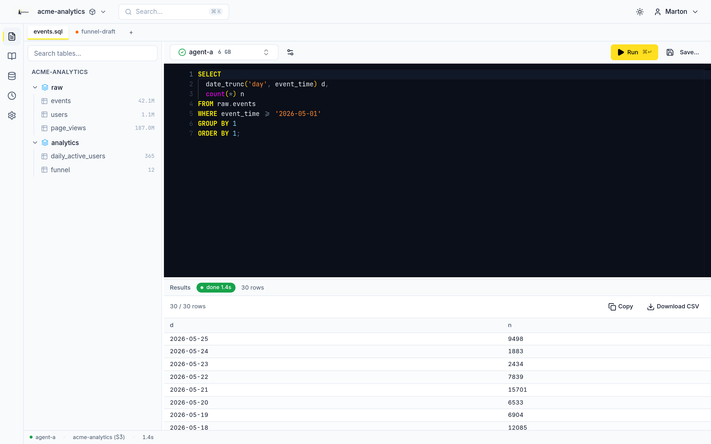
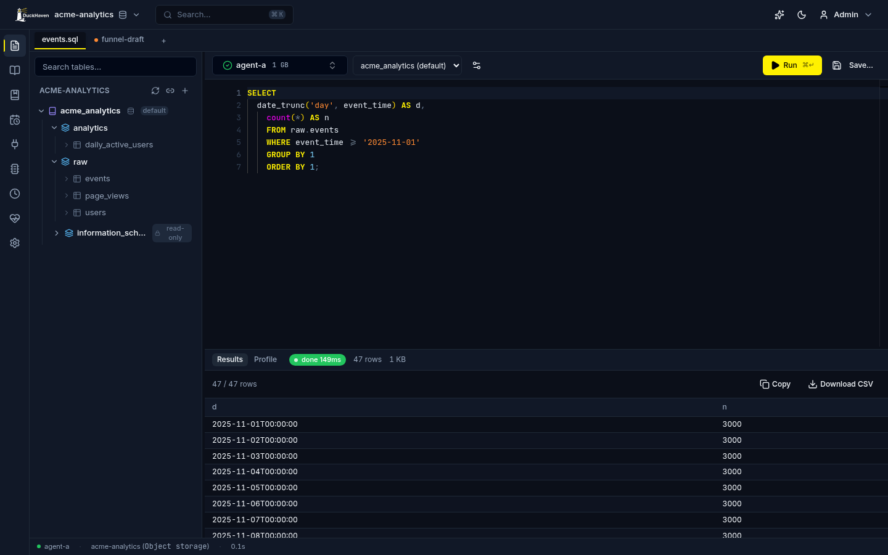
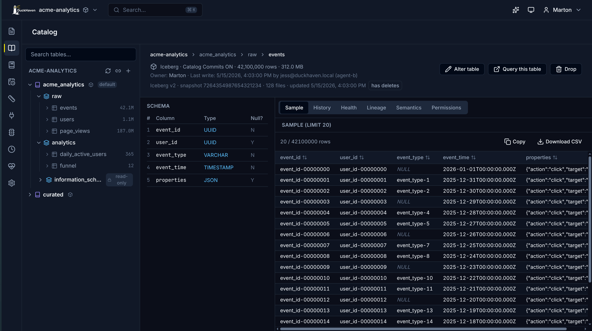
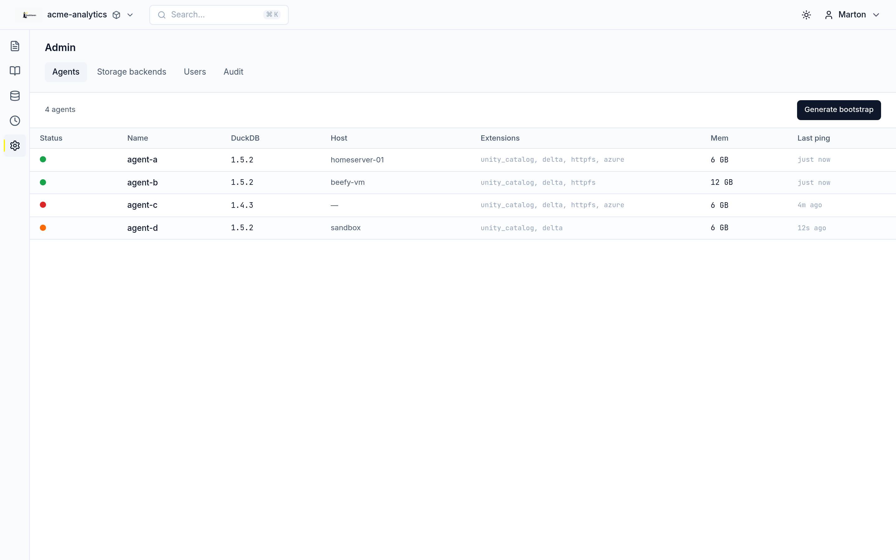
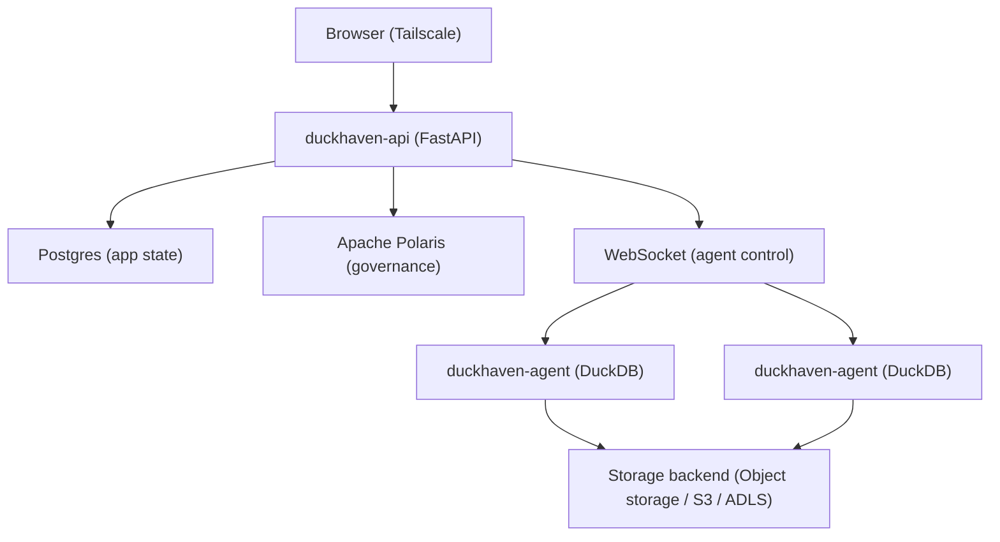

# DuckHaven

> A self-hosted collaborative SQL workspace for DuckDB teams.



Your team loves DuckDB, but sharing `.duckdb` files across Slack is chaos. You
want the worksheet experience of Databricks or Snowflake without the enterprise
gravity, and MotherDuck-style collaboration without the cloud lock-in.

DuckHaven is a self-hosted analytics workspace that lets teams write, share, and
govern SQL queries over DuckDB. It combines browser-based worksheets with Apache
Polaris governance — lightweight enough for a homelab, serious enough for a team.
No cloud warehouse lock-in, no Kubernetes, no opaque billing, no platform team
required.

## Alternatives

DuckHaven is not the only way to run SQL over DuckDB. Pick the tool that fits
your constraints:

- **[MotherDuck](https://motherduck.com/)** is managed DuckDB in the cloud, with
  collaboration and sharing built in. Use it when you want zero operational
  overhead and are comfortable with a SaaS holding your data.
- **[Databricks](https://www.databricks.com/)** is the enterprise lakehouse —
  Spark, notebooks, and Unity Catalog Enterprise. Use it when you have a platform
  team, a Kubernetes budget, and workloads that outgrow a single box.
- **Ad hoc DuckDB** is a `.duckdb` file and a CLI. Use it for solo, throwaway
  analysis where collaboration, query history, and governance don't matter.

| | DuckHaven | MotherDuck | Databricks | Ad hoc DuckDB |
|---|---|---|---|---|
| **Hosting** | Self-hosted | Cloud SaaS | Cloud/Enterprise | Local only |
| **Engine** | DuckDB | DuckDB | Spark/JVM | DuckDB |
| **Collaboration** | Worksheets + catalog + audit | Worksheets + sharing | Worksheets + notebooks | None |
| **Governance** | Apache Polaris | Proprietary | Unity Catalog Enterprise | None |
| **Complexity** | Docker Compose | Zero setup | Kubernetes + platform team | Scripts |
| **Cost model** | Free (self-hosted) | Per-seat SaaS | Enterprise contract | Free |

**Use DuckHaven instead when** you run a homelab or a small team and want
collaborative, governed SQL over DuckDB on your own infrastructure — browser
worksheets, a shared catalog, per-workspace permissions, and a full audit
trail — with data sovereignty, network privacy, and no SaaS lock-in.

## Features

- **Browser-Based Worksheets** — Monaco SQL editor with tabs, results grid, and
  CSV export. Write queries together without emailing SQL snippets.
- **Shared Catalog** — Browse schemas and tables with sample rows. Every table
  is Iceberg-native with Catalog Commits ON.
- **Governed Workspaces** — Per-workspace permissions, Polaris catalog
  integration, and a full audit trail of who ran what.
- **Transparent Compute** — You pick the DuckDB agent per query. No opaque
  optimizer, no surprise costs, no hidden resource allocation.
- **Self-Hosted** — Docker Compose on your network. Your data never leaves your infrastructure.
- **Short-Lived Credentials** — Polaris vends temporary storage credentials per query. No long-lived secrets on agents.

## Screenshots

### SQL Worksheet

The primary surface. Write SQL, pick your agent, run queries, and browse results.



### Catalog Browser

Inspect table schemas and preview sample rows without writing a query.



### Agent Management

Register agents, view capabilities, and generate bootstrap tokens from the admin panel.



## Architecture

DuckHaven separates control from compute. The control plane manages users,
workspaces, and queries. DuckDB agents connect via WebSocket to execute SQL and
return results.



**Key design choices:**

- The control plane does **not** run DuckDB. Compute lives in agent processes that dial home over WebSocket.
- Users pick the executing agent per worksheet — transparent compute, no opaque optimizer.
- Every workspace is bound to exactly one storage backend: bundled object storage (MinIO), S3, or Azure.
- Apache Polaris provides table governance and vends short-lived storage credentials per query.
- SQL is allowlisted to data statements
  (`SELECT`/`INSERT`/`UPDATE`/`DELETE`/`MERGE`) and catalog DDL
  (`CREATE`/`ALTER`/`DROP`), executed on the agent against the Polaris catalog;
  sandbox escapes (`ATTACH`, `COPY`, `LOAD`, `SET`, …) are rejected.
- The API is exposed directly on port 8000 over a private network (Tailscale
  recommended); there is no public ingress.

For the full architecture, see [docs/ARCHITECTURE.md](docs/ARCHITECTURE.md). For
the UI design system, see [docs/UI-DESIGN.md](docs/UI-DESIGN.md).

## Tech Stack

| Layer | Choice |
|---|---|
| Frontend | React 19 + TypeScript + Vite, Monaco SQL editor, TanStack Router/Query/Table, Radix UI + shadcn/ui + Tailwind |
| API / control plane | FastAPI (Python 3.14), async; `websockets` for the agent channel |
| Database | PostgreSQL 16, SQLAlchemy 2.x (async) + Alembic migrations |
| Agent | Python 3.14 embedding DuckDB; small HTTP server for result Parquet reads |
| Engine | DuckDB ≥ 1.5 — present **only** on agents |
| Catalog | Apache Polaris — catalog + short-lived credential vendor |
| Storage format | Apache Iceberg, Catalog Commits ON, one backend per workspace |
| Storage backends | Object storage (bundled MinIO, `httpfs`), S3 (`httpfs`), ADLS Gen 2 (`azure`) |
| Package management | uv (Python workspace), npm (web) |
| Containerisation | Docker Compose (control plane); single container per agent |
| Tests | pytest + pytest-asyncio (api, agent); Vitest + React Testing Library + MSW (web) |

## Quickstart

```bash
curl -O https://raw.githubusercontent.com/tamasmrtn/duckhaven/main/deploy/docker-compose.yml
docker compose up -d
docker compose exec api cat /var/duckhaven/setup_token
# open http://<host>:8000 and paste the token into the setup screen
```

That is the whole install — no `git clone`, no `.env` editing, no
`make` on the host. Secrets generate on first boot, migrations apply
inside the api container, the first admin is created from the browser.

## Self-hosting docs

- [Install](docs/self-hosting/install.md)
- [Update](docs/self-hosting/update.md)
- [Reverse proxy + TLS (Caddy)](docs/self-hosting/reverse-proxy.md)
- [Backup & restore](docs/self-hosting/backup-restore.md)
- [Add an agent](docs/self-hosting/add-agent.md)

For local development (running the API and Vite dev server against a
compose-managed Postgres) see [docs/DEVELOPMENT.md](docs/DEVELOPMENT.md). For
cutting a new release see [docs/RELEASING.md](docs/RELEASING.md).

## Roadmap

- **Shipped** — SQL worksheets, catalog browser, query dispatch to agents,
  Polaris/Iceberg catalog integration with native table metadata, workspace
  permissions, saved queries, audit log, storage backend registry, agent
  bootstrap tokens, name-only workspace creation, result size reporting, result
  retention sweep, multi-agent dispatch, live agent CPU/memory utilization,
  published agent and API images (GHCR), server-side backend compatibility
  checks, Iceberg snapshot history browsing with "query at this snapshot"
  time travel.
- **In progress** — External cloud-backend (S3 / ADLS Gen 2) credential wiring.
- **Future** — Notebook UI, heterogeneous engines (Spark, Trino, Polars),
  per-table backend override, Polaris RBAC permission mirroring, control-plane
  HA, Prometheus metrics + Grafana dashboards, off-box result durability / DR
  automation.

See [docs/ARCHITECTURE.md](docs/ARCHITECTURE.md) §13 for the gap tracker.

## Contributing

Conventional commits, branch prefixes (`feat/`, `fix/`, `chore/`, `docs/`,
`refactor/`, `test/`), and tests for every change. See [CLAUDE.md](CLAUDE.md)
for the full development guidelines.

- Frontend: Vitest + React Testing Library + MSW
- Backend: pytest + pytest-asyncio (API ≥80% coverage, agent ≥75% coverage)

### Development Setup

```bash
make install      # uv sync --all-packages + npm install in web/
make dev-api       # FastAPI with hot reload on :8000
make dev-web       # Vite dev server on :5173 (MSW mocks if the API is down)
make test          # API + agent + web tests
make lint          # Ruff + ESLint
make format        # Ruff + Prettier
```

Repository layout:

| Directory | Contents |
|---|---|
| `web/` | React + TypeScript + Vite frontend |
| `api/` | FastAPI control plane |
| `agent/` | DuckDB compute agent |
| `shared/` | Python types shared by api and agent |
| `deploy/` | Docker Compose stack, env template |
| `scripts/` | Operator helper scripts |
| `docs/` | Architecture, design, deployment, and development docs |

## Inspiration

DuckHaven's worksheet experience draws on MotherDuck; it stands on
[DuckDB](https://duckdb.org/) for compute and
[Apache Polaris](https://polaris.apache.org/) for governance and credential
vending.

## License

MIT. See [LICENSE](LICENSE) for details.
