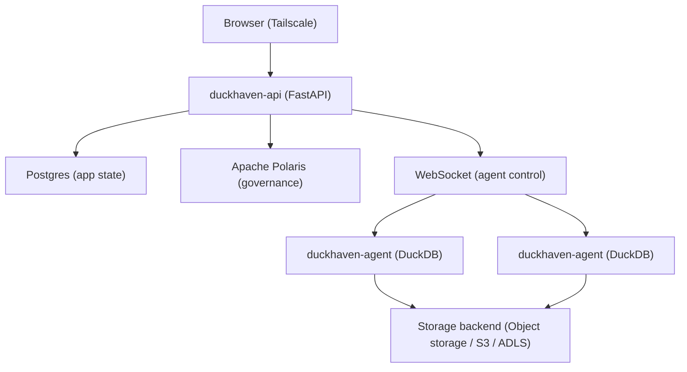

# DuckHaven

> A self-hosted, governed DuckDB + Iceberg analytics platform for small teams.


Your team loves DuckDB, but sharing `.duckdb` files across Slack is chaos. You
want the worksheet experience of Databricks or Snowflake without the enterprise
gravity, and MotherDuck-style collaboration without the cloud lock-in.

DuckHaven is a self-hosted analytics platform that lets a team write, schedule,
maintain, and govern SQL over DuckDB. It started as collaborative browser
worksheets and grew to cover the lifecycle around them: a governed Apache Iceberg
catalog (via Apache Polaris), recurring scheduled queries, an advisory lakehouse
maintenance scanner, single sign-on, and bring-your-own object storage — plus
fine-grained catalog/schema/table access grants, machine identities for
automation, and a governed AI data assistant. It is deliberately right-sized —
lightweight enough for a homelab, serious enough for a team — not an
enterprise lakehouse for petabyte fleets. No cloud warehouse lock-in, no
Kubernetes, no opaque billing, no platform team required.

**Documentation:** <https://tamasmrtn.github.io/duckhaven/>

## Alternatives

DuckHaven is not the only way to run SQL over DuckDB. Pick the tool that fits
your constraints:

- **[MotherDuck](https://motherduck.com/)** is managed DuckDB in the cloud, with
  collaboration and sharing built in. Use it when you want zero operational
  overhead and are comfortable with a SaaS holding your data.
- **[Databricks](https://www.databricks.com/)** is the enterprise lakehouse —
  Spark, notebooks, and Unity Catalog Enterprise. Use it when you have a platform
  team, a Kubernetes budget, and workloads that outgrow a single box.
- **Ad hoc DuckDB** is a `.duckdb` file and a CLI. Use it for solo, throwaway
  analysis where collaboration, query history, and governance don't matter.

| | DuckHaven | MotherDuck | Databricks | Ad hoc DuckDB |
|---|---|---|---|---|
| **Hosting** | Self-hosted | Cloud SaaS | Cloud/Enterprise | Local only |
| **Engine** | DuckDB | DuckDB | Spark/JVM | DuckDB |
| **Collaboration** | Worksheets + catalog + scheduling + audit | Worksheets + sharing | Worksheets + notebooks | None |
| **Governance** | Apache Polaris | Proprietary | Unity Catalog Enterprise | None |
| **Complexity** | Docker Compose | Zero setup | Kubernetes + platform team | Scripts |
| **Cost model** | Free (self-hosted) | Per-seat SaaS | Enterprise contract | Free |

**Use DuckHaven instead when** you run a homelab or a small team and want
collaborative, governed SQL over DuckDB on your own infrastructure — browser
worksheets, a shared Iceberg catalog, scheduled queries, per-workspace
permissions, single sign-on, and a full audit trail — with data sovereignty,
network privacy, and no SaaS lock-in.

## Features

### Worksheets & query execution

- **Browser-based worksheets** — Monaco SQL editor with tabs, catalog-aware
  autocomplete, and a paginated results grid that pages results by row window
  instead of loading the whole file. Statement-aware Run (Ctrl+Enter runs the
  statement under the cursor), mid-flight cancel, and CSV export.
- **Transparent compute** — You pick the DuckDB agent per query. No opaque
  optimizer, no surprise costs, no hidden resource allocation.
- **Right-sized memory** — Each query's memory reservation is estimated from
  DuckDB's optimizer plan (`EXPLAIN`), so cheap queries pack in while heavy ones
  reserve more (and queue when the agent is busy). The agent never oversubscribes
  its memory budget.
- **Query profiles** — After a query runs, inspect a per-operator profile: an
  interactive operator graph with rows in → out, bytes, and timing per step,
  plus automatic flags for spills to disk, scan blow-ups, and bad cardinality
  estimates.

### Catalogs & data

- **Multi-catalog workspaces** — Catalogs are decoupled from workspaces
  (many-to-many): attach, detach, create, and drop catalogs, and query across
  them with fully-qualified names.
- **Catalog browser** — Walk workspace → catalog → schema → table → column and
  preview sample rows without writing a query.
- **Iceberg-native tables** — Every table is Apache Iceberg with Catalog Commits
  ON, governed by Polaris.
- **Snapshot history & time travel** — Browse a table's Iceberg snapshots and run
  "query at this snapshot" against any point in its history.
- **Built-in metadata** — A read-only `information_schema` per catalog, plus a
  Postgres-side sidecar for ownership, last-write provenance, and row/size stats
  that Polaris does not track.

### Governance, access & audit

- **Governed workspaces** — Per-workspace roles (reader / writer / owner) on top
  of global admin / user roles.
- **Scoped access grants** — Go below the workspace role: grant reader / writer
  / discovery-only `metadata` access at the catalog, schema, or table level,
  inherited downward and capped at the workspace role. Opt-in per catalog
  attachment (`open` vs `scoped`); today's uniform-role behavior is the
  unchanged default.
- **Machine auth** — DuckHaven-native service accounts (first-class RBAC
  members, not a parallel system) with Personal Access Tokens for scripts,
  automation, and the AI assistant's own governed identity. Operator-chosen
  expiry (30d / 90d / 1y / never).
- **Single sign-on** — Local accounts plus OIDC SSO (multiple providers) and
  LDAP / Active Directory, with just-in-time user provisioning and IdP
  group → role mapping.
- **SQL allowlist** — Only data statements and catalog DDL run on agents; sandbox
  escapes (`ATTACH`, `COPY`, `LOAD`, `SET`, …) are rejected at the control plane.
- **Audit trail** — Every query (interactive or scheduled) is logged with the
  user, agent, SQL, status, row count, and duration.

### Automation & operations

- **Scheduled queries** — Run saved queries on a cron schedule (UTC), leader-elected
  across replicas, with a per-schedule run history. No overlap, no backfill, and
  no automatic retries — the next tick is the next attempt.
- **Saved queries** — Persist queries with an optional default agent and open them
  as worksheet tabs.
- **Lakehouse maintenance advisor** — A background scanner scores catalog health
  (fragmentation, snapshot hygiene, metadata, storage efficiency) and raises
  *advisory* recommendations (compact small files, expire snapshots, clean up
  orphans). It recommends; it never rewrites your tables.
- **Agent management** — A registry of connected agents with capability
  advertisement (DuckDB version, extensions, cores, memory), backend-compatibility
  checks, one-time bootstrap tokens, and live CPU / memory / queue utilization.
- **Prometheus metrics** — An optional `/metrics` endpoint exposes query, agent,
  and Polaris credential-vending instrumentation.
- **Highly available (opt-in)** — The default deploy is single-node; an opt-in
  topology adds HA Postgres plus multiple API replicas behind a load balancer on
  the same Compose foundation.
- **AI data assistant (opt-in)** — A governed, model-agnostic chat assistant
  (OpenAI / Anthropic / Mistral / Ollama-compatible) that browses catalog
  metadata, authors and runs SQL, and proposes worksheet edits with
  diff-highlighted Accept/Reject — running as an audited service-account
  principal through the same enforcement chokepoints as a human user. Disabled
  by default.

### Storage

- **Bring your own storage** — One backend per workspace: bundled object
  storage (MinIO), AWS S3, or Azure ADLS Gen 2.
- **Live storage migration** — Move a catalog to a different backend after
  creation (e.g. bundled MinIO → S3, or S3 → ADLS) without losing data or
  Iceberg snapshot history, via a checkpointed background migration engine.
- **Short-lived credentials** — Polaris vends temporary, connection-scoped storage
  credentials per query (S3 assume-role → STS, ADLS → Entra-minted SAS). No
  long-lived secrets ever land on agents.
- **Self-hosted** — Docker Compose on your network. Your data never leaves your
  infrastructure.

## Screenshots

### SQL Worksheet

The primary surface. Write SQL, pick your agent, run queries, and browse results.


### Catalog Browser

Inspect table schemas and preview sample rows without writing a query.


### Agent Management

Register agents, view capabilities, and generate bootstrap tokens from the admin panel.


## Architecture

DuckHaven separates control from compute. The control plane manages users,
workspaces, and queries. DuckDB agents connect via WebSocket to execute SQL and
return results.



**Key design choices:**

- The control plane does **not** run DuckDB. Compute lives in agent processes that dial home over WebSocket.
- Users pick the executing agent per worksheet — transparent compute, no opaque optimizer.
- Every workspace is bound to exactly one storage backend: bundled object storage (MinIO), S3, or Azure.
- Apache Polaris provides table governance and vends short-lived storage credentials per query.
- SQL is allowlisted to data statements
  (`SELECT`/`INSERT`/`UPDATE`/`DELETE`/`MERGE`) and catalog DDL
  (`CREATE`/`ALTER`/`DROP`), executed on the agent against the Polaris catalog;
  sandbox escapes (`ATTACH`, `COPY`, `LOAD`, `SET`, …) are rejected.
- The API is exposed directly on port 8000 over a private network (Tailscale
  recommended); there is no public ingress.
- The default deploy is single-node, but an opt-in highly-available topology — HA
  Postgres plus multiple API replicas behind a load balancer — is available on
  the same Docker Compose foundation. See
  [High availability](docs/deployment/high-availability.md).

For the full architecture, see [docs/concepts/architecture.md](docs/concepts/architecture.md). For
the UI design system, see [docs/developer/design-system.md](docs/developer/design-system.md).

## Tech Stack

| Layer | Choice |
|---|---|
| Frontend | React 19 + TypeScript + Vite, Monaco SQL editor, TanStack Router/Query/Table, Radix UI + shadcn/ui + Tailwind |
| API / control plane | FastAPI (Python 3.14), async; `websockets` for the agent channel |
| Database | PostgreSQL 16, SQLAlchemy 2.x (async) + Alembic migrations |
| Agent | Python 3.14 embedding DuckDB; small HTTP server for result Parquet reads |
| Engine | DuckDB ≥ 1.5 — present **only** on agents |
| Catalog | Apache Polaris — catalog + short-lived credential vendor |
| Storage format | Apache Iceberg, Catalog Commits ON, one backend per workspace |
| Storage backends | Object storage (bundled MinIO, `httpfs`), S3 (`httpfs`), ADLS Gen 2 (`azure`) |
| Auth | Local (`bcrypt`), OIDC SSO (`authlib`), LDAP / AD (`ldap3`) with JIT provisioning |
| Scheduling | Cron-based recurring queries (`croniter`), leader-elected across replicas |
| Metrics | Optional Prometheus `/metrics` endpoint (`prometheus-client`) |
| Package management | uv (Python workspace), npm (web) |
| Containerisation | Docker Compose (control plane); single container per agent |
| Tests | pytest + pytest-asyncio (api, agent); Vitest + React Testing Library + MSW (web) |

## Quickstart

```bash
curl -O https://raw.githubusercontent.com/tamasmrtn/duckhaven/main/deploy/docker-compose.yml
docker compose up -d
docker compose exec api cat /var/duckhaven/setup_token
# open http://<host>:8000 and paste the token into the setup screen
```

That is the whole install — no `git clone`, no `.env` editing, no
`make` on the host. Secrets generate on first boot, migrations apply
inside the api container, the first admin is created from the browser.

## Self-hosting docs

- [Install](docs/deployment/install.md)
- [Update](docs/deployment/updating.md)
- [Storage backends (MinIO / S3 / ADLS)](docs/deployment/storage.md)
- [Single sign-on (OIDC)](docs/guides/connect-idp.md)
- [LDAP / Active Directory](docs/guides/connect-ldap.md)
- [Reverse proxy + TLS (Caddy)](docs/deployment/reverse-proxy-tls.md)
- [High availability](docs/deployment/high-availability.md)
- [Monitoring (Prometheus)](docs/operations/monitoring.md)
- [Backup & restore](docs/deployment/backup-restore.md)
- [Add an agent](docs/deployment/add-agent.md)

For local development (running the API and Vite dev server against a
compose-managed Postgres) see [docs/developer/development.md](docs/developer/development.md). For
cutting a new release see [docs/developer/releasing.md](docs/developer/releasing.md).

## Roadmap

- **Shipped** — SQL worksheets, catalog browser, query dispatch to agents,
  Polaris/Iceberg catalog integration with native table metadata, multi-catalog
  workspaces (decoupled, many-to-many), workspace permissions plus OIDC SSO and
  LDAP / AD with JIT provisioning and group→role mapping, saved queries,
  scheduled/recurring queries with run history, the autonomous lakehouse
  maintenance advisor, audit log, storage backend registry, S3 / ADLS Gen 2
  storage backends (write paths validated behind opt-in integration tests),
  agent bootstrap tokens, name-only workspace creation, result size reporting,
  result retention sweep, multi-agent dispatch, live agent CPU/memory
  utilization, an optional Prometheus `/metrics` endpoint, published agent and
  API images (GHCR), server-side backend compatibility checks, Iceberg snapshot
  history browsing with "query at this snapshot" time travel, EXPLAIN-based
  per-query memory sizing (the `auto` concurrency profile), post-execution query
  profiles with inefficiency highlights, an opt-in
  [highly-available control plane](docs/deployment/high-availability.md)
  (HA Postgres + multiple API replicas behind a load balancer), and
  [catalog storage-backend migration](docs/guides/migrate-catalog-storage.md)
  (move a catalog to a different backend after creation, preserving all data and
  Iceberg snapshot history), [fine-grained catalog/schema/table access
  grants](docs/guides/access-levels.md) with an opt-in scoped access mode and a
  discovery-only `metadata` tier, [DuckHaven-native service accounts and
  Personal Access Tokens](docs/guides/service-accounts.md) for machine auth,
  and a [governed AI data assistant](docs/concepts/assistant.md) (model-agnostic,
  Pydantic AI) that browses the catalog, authors and runs SQL, and proposes
  worksheet edits as an audited service-account principal.
- **In progress** — Finishing the Polaris `storageConfigInfo` credential wiring
  (role ARN / tenant) so external S3 / ADLS Gen 2 backends are production-ready
  outside the opt-in integration tests.
- **Future** — Notebook UI, heterogeneous engines (Spark, Trino, Polars),
  Polaris RBAC permission mirroring, Grafana dashboards, off-box result
  durability / DR automation, and for the AI assistant: an MCP server, chart
  generation, RAG over table contents, and multi-agent workflows.

See [docs/concepts/architecture.md](docs/concepts/architecture.md) §13 for the gap tracker.

## Contributing

Conventional commits, branch prefixes (`feat/`, `fix/`, `chore/`, `docs/`,
`refactor/`, `test/`), and tests for every change. See [CLAUDE.md](CLAUDE.md)
for the full development guidelines.

- Frontend: Vitest + React Testing Library + MSW
- Backend: pytest + pytest-asyncio (API ≥80% coverage, agent ≥75% coverage)

### Development Setup

```bash
make install      # uv sync --all-packages + npm install in web/
make dev-api       # FastAPI with hot reload on :8000
make dev-web       # Vite dev server on :5173 (MSW mocks if the API is down)
make test          # API + agent + web tests
make lint          # Ruff + ESLint
make format        # Ruff + Prettier
```

Repository layout:

| Directory | Contents |
|---|---|
| `web/` | React + TypeScript + Vite frontend |
| `api/` | FastAPI control plane |
| `agent/` | DuckDB compute agent |
| `shared/` | Python types shared by api and agent |
| `deploy/` | Docker Compose stack, env template |
| `scripts/` | Operator helper scripts |
| `docs/` | Architecture, design, deployment, and development docs |

## Inspiration

DuckHaven's worksheet experience draws on MotherDuck; it stands on
[DuckDB](https://duckdb.org/) for compute and
[Apache Polaris](https://polaris.apache.org/) for governance and credential
vending.

## License

GNU Affero General Public License v3.0 (AGPLv3). See [LICENSE](LICENSE) for details.
