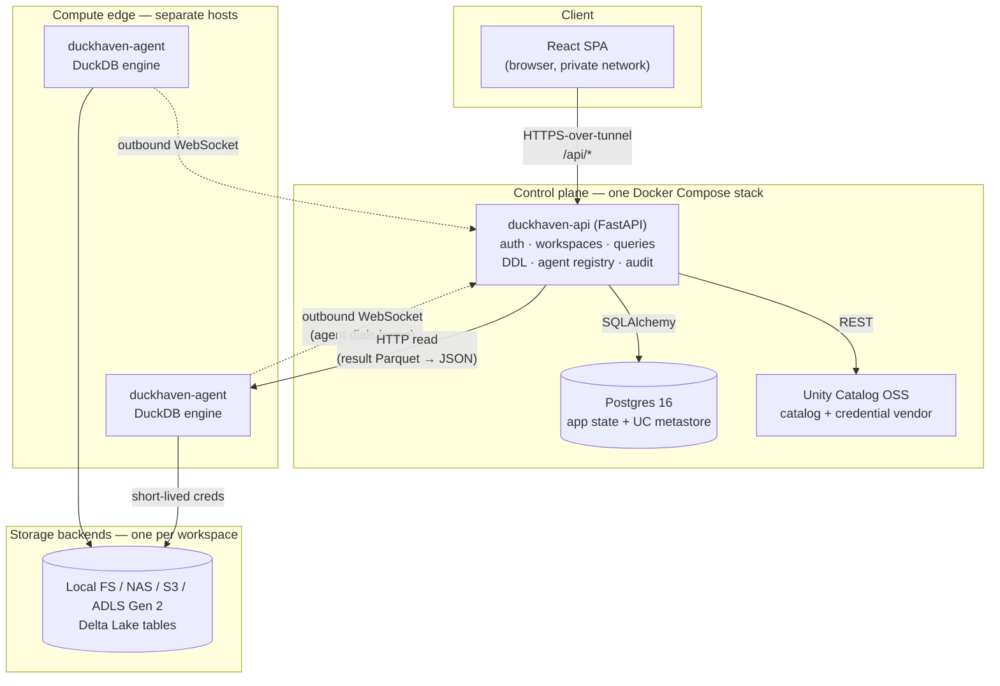
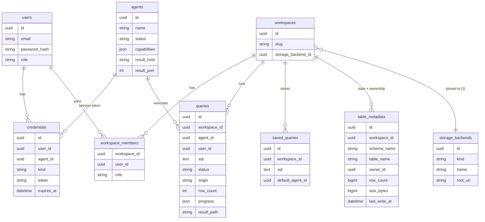
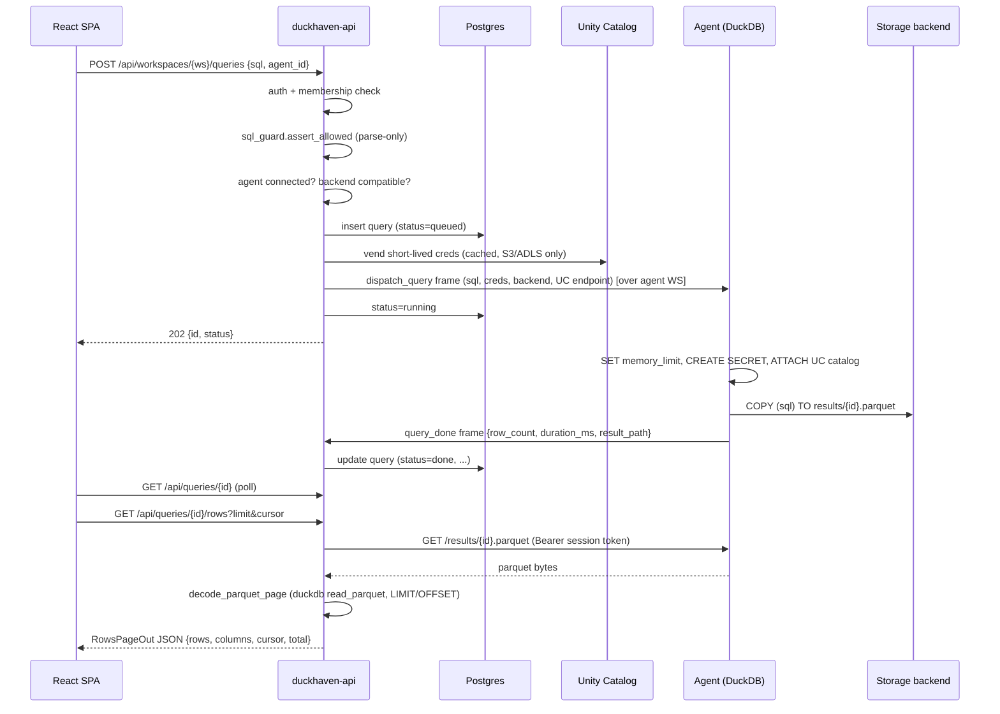
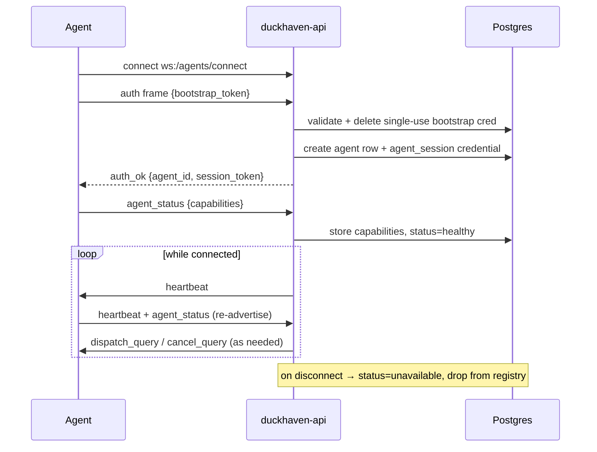

# DuckHaven — Architecture

This document is the map of the DuckHaven codebase. It explains what the
system is, how it is organized, how data moves through it, and — most
importantly — **where to make a change**. It is written to be read in one
sitting by a new contributor or a coding agent before touching the code.

It deliberately describes *stable structure and invariants*, not progress.
For roadmap and milestone status see the [README](../README.md#roadmap) and
the issue tracker. For setup and operations see
[DEVELOPMENT.md](DEVELOPMENT.md), [RUNBOOK.md](RUNBOOK.md), and
[self-hosting/](self-hosting/).

---

## 1. Overview

DuckHaven is a **self-hosted, browser-based SQL workspace** for teams that
run [DuckDB](https://duckdb.org/) over Delta Lake tables governed by
[Unity Catalog OSS](https://www.unitycatalog.io/). It gives a small team
(2–10 users) collaborative worksheets, a shared catalog, per-workspace
permissions, and a full audit trail — without a cloud warehouse, Kubernetes,
or a platform team.

Architecturally, DuckHaven is a **control plane / compute split**:

- The **control plane** (`api/`) is a single FastAPI process. It owns
  identity, workspaces, the catalog/DDL, query state, and the agent
  registry. **It never runs DuckDB queries.**
- **Compute** lives in one or more **agents** (`agent/`). Each agent embeds
  a DuckDB engine, runs on its own host, and *dials home* to the control
  plane over a WebSocket. Users pick which agent runs each query.

The result is a system that is small at the center (a Docker Compose stack
on one homelab-class box) and horizontally expandable at the edge (add an
agent host when you need more compute).

| Concern | Choice |
|---|---|
| Control plane | One `docker compose` stack: Postgres + Unity Catalog + the API |
| Compute | 1..N DuckDB **agents** on separate hosts |
| Engines | DuckDB only (heterogeneous versions allowed) |
| Storage | Delta Lake on Local FS / NAS / S3 / ADLS Gen 2 (one backend per workspace) |
| Catalog & credentials | Unity Catalog OSS — table governance + short-lived credential vending |
| Frontend | React SPA — SQL worksheets (no notebooks) |
| Network | Private only (Tailscale recommended); no public ingress |

---

## 2. Purpose & Philosophy

**Why DuckHaven exists.** Teams that love DuckDB end up sharing `.duckdb`
files over chat. DuckHaven provides the worksheet/collaboration experience
of MotherDuck or Databricks while keeping data on your own infrastructure,
with no SaaS lock-in and no opaque billing.

Two ideas shape nearly every design decision:

1. **DuckHaven is a dispatcher, not an optimizer.** The user picks the
   engine (agent) per worksheet. There is no distributed query planner and
   no cost-based routing. Compute is transparent and explicit.
2. **A workspace is bound to exactly one storage backend.** This binding is
   chosen at workspace-create time, is immutable, and is enforced on every
   write. It keeps governance, credentials, and disaster-recovery reasoning
   simple.

### Non-goals (explicit boundaries)

- **Not a Spark/Databricks replacement.** No distributed query plan; agents
  are independent DuckDB processes with no cross-agent atomicity.
- **Not multi-engine (yet).** DuckDB only. The agent contract is drawn so a
  second engine type can be added without re-architecting the control plane.
- **Not a notebook platform.** SQL worksheets only.
- **Not internet-exposed.** The private network (Tailscale/WireGuard) is the
  security perimeter; the API speaks plain HTTP behind it.
- **Not authoritative storage and not an ingestion engine.** Source data
  lives in the backends; external tools (delta-rs, dlt, Airbyte) write it.
- **No `UPDATE`/`MERGE`/`DELETE`, no cross-workspace joins, no row/column
  security** in the current scope. Permissions are workspace-level.

---

## 3. High-Level Architecture



The defining structural fact: **the only long-lived connection between the
control plane and an agent is initiated *by the agent*** (the WebSocket
control channel). The control plane reaches back to an agent in exactly one
place — an HTTP `GET` to fetch the result Parquet, which the API decodes to
JSON rows. Everything else flows over the agent-initiated socket.

---

## 4. Core Architectural Principles

1. **Separation of control and compute.** The control plane orchestrates;
   agents execute. The control plane process never opens a DuckDB database
   (it uses DuckDB *only as a SQL parser* — see Invariant I1).
2. **Agents are cattle that dial home.** An agent needs only a control-plane
   URL and a bootstrap token. It registers itself, advertises its
   capabilities, and holds one socket open. The control plane keeps no
   static inventory of agent addresses.
3. **Unity Catalog is the source of truth for catalog structure.** Schemas,
   tables, columns, and table properties live in UC, not in Postgres. DuckHaven
   never shadows catalog *structure* in its own database — it only keeps a
   supplementary `table_metadata` sidecar for facts UC does not track
   (ownership, last-write provenance, row/size stats).
4. **Postgres is the single state-of-record for everything DuckHaven owns**
   (users, workspaces, queries, agents). There is no Redis or separate queue
   — query dispatch is a direct push over the agent socket.
5. **Credentials are short-lived and connection-scoped.** UC vends temporary
   storage credentials per `(agent, workspace)`; the agent applies them as a
   DuckDB `SECRET` that dies with the per-query connection.
6. **The wire contract is shared, not duplicated.** The control↔agent frame
   protocol lives in one package (`shared/`) imported by both sides, so it
   cannot drift.

---

## 5. Repository Structure

DuckHaven is a polyglot monorepo: a `uv` Python workspace (`api`, `agent`,
`shared`) plus an npm React app (`web`).

```
duckhaven/
├── api/          FastAPI control plane (the "brain")
├── agent/        DuckDB compute agent (the "muscle")
├── shared/       duckhaven-shared: the control↔agent wire contract
├── web/          React SPA (SQL worksheets, catalog, admin)
├── deploy/       Docker Compose stack, entrypoints, secrets bootstrap
├── scripts/      Operator helpers (pg backup, token generation)
├── docs/         This file + development, runbook, self-hosting guides
├── Makefile      Canonical dev/test/lint/migrate/compose commands
└── pyproject.toml  uv workspace root (members: api, agent, shared)
```

Each Python package owns its own `pyproject.toml`. `api` and `agent` both
declare `duckhaven-shared = { workspace = true }`. The dependency direction
is strict: **`api` and `agent` depend on `shared`; nothing depends on `api`
or `agent`** (Invariant I6).

---

## 6. Code Map

This is the navigation core. For each package: what it is for, how its
internals are organized, and the files to open first.

### 6.1 `shared/` — `duckhaven_shared` (the contract)

**Purpose.** The single source of truth for the control-plane ↔ agent wire
format. Tiny by design (only depends on `pydantic`).

| Module | Defines |
|---|---|
| `protocol.py` | `FrameType` (string enum) and `Frame` (`{type, payload}`) — every message on the control WebSocket |
| `schemas.py` | `AgentCapabilities` — the document an agent advertises (DuckDB version, loaded extensions, memory ceiling, cores, host) |

`FrameType` values: `auth`, `auth_ok`, `dispatch_query`, `query_progress`,
`query_done`, `cancel_query`, `heartbeat`, `agent_status`. **Adding or
changing a frame means editing this package** — both sides pick it up by
import, which is how the contract stays in sync (Invariant I5).

### 6.2 `api/` — `duckhaven-api` (control plane)

**Purpose.** Everything the browser talks to, plus the agent-facing
WebSocket. A FastAPI app backed by async SQLAlchemy + Postgres.

**App composition** (`src/api/main.py`) — important to understand the URL
surface:

- An **outer** ASGI app mounts three things:
  - the **agent WebSocket** at `/agents/connect` (root level — agents dial here),
  - the **REST API** sub-app under **`/api`** (shares an origin with the SPA),
  - the **built SPA** as static files at `/` (only present in the image; a
    catch-all serves `index.html` so client-side routes deep-link).
- The REST sub-app owns a lifespan that constructs the shared `UCClient`
  and the credential `CredCache` (held on `app.state`).

**Internal layout:**

| Directory | Responsibility |
|---|---|
| `routers/` | HTTP/WS endpoints. One module per resource: `auth`, `workspaces`, `schemas` (catalog DDL + table sample), `queries`, `agents`, `health`, `setup`, plus `agents_ws` (the agent WebSocket) and `admin/` (`agents`, `storage`, `audit`). |
| `services/` | Business logic, framework-free. The interesting code lives here (see below). |
| `models/` | SQLAlchemy ORM models = the Postgres schema. |
| `schemas/` | Pydantic request/response DTOs (distinct from ORM models). |
| `db/` | Engine/session setup (`session.py`) and the declarative `Base`. |
| `deps.py` | FastAPI dependencies: `get_db`, `get_current_user`, `get_uc_client`, `get_cred_cache`. |
| `config.py` | `pydantic-settings` config (DB URL, UC URL, cookie/secret/TTL settings). |
| `alembic/` | Database migrations. Applied automatically by the container entrypoint in production. |

**Key services to know:**

| Service | What it does | Interacts with |
|---|---|---|
| `services/query.py` | Dispatches a query to an agent over the registry socket; handles `query_progress`/`query_done` frames coming back; fetches the result Parquet from the agent and decodes it to JSON rows (`decode_parquet_page`); also drives the synchronous table-sample preview and persists agent-reported table stats. **The heart of the system.** | `agent_registry`, `uc_credentials`, `unity_catalog`, the `Query`/`TableMetadata` models |
| `services/agent_registry.py` | In-memory `ConnectionManager` (`registry`) mapping `agent_id → live WebSocket`. The only place that knows which agents are connected *right now*. | `routers/agents_ws.py`, `services/query.py` |
| `services/unity_catalog.py` | Async REST client for UC (catalogs, schemas, tables, permissions, temporary-table-credentials). Speaks REST directly via `httpx`. | UC container |
| `services/uc_credentials.py` | `CredCache` with half-TTL refresh + `vend_workspace_creds`. Mints short-lived S3/Azure creds; returns `None` for local/NAS. | `unity_catalog`, `services/query.py` |
| `services/sql_guard.py` | The SQL allowlist. Uses `duckdb.extract_statements` to **parse only** and reject anything other than `SELECT`/`INSERT`. No connection, no execution. | `routers/queries.py` |
| `services/agent_capabilities.py` | Maps a backend kind to its required DuckDB extension and checks an agent's advertised capabilities at dispatch time. | `routers/queries.py` |
| `services/workspace.py` | Membership/role checks (`assert_workspace_member`), workspace lookup, lazy UC catalog creation (`ensure_uc_catalog`), best-effort UC grant mirroring. | UC, the `Workspace`/`WorkspaceMember` models |
| `services/auth.py` | bcrypt password hashing/verification and session-cookie handling. | `routers/auth.py`, `routers/setup.py` |

### 6.3 `agent/` — `duckhaven-agent` (compute)

**Purpose.** Embed a DuckDB engine, execute dispatched queries, and serve
result files. An agent is a single Python process running three concurrent
tasks (`src/agent/main.py` gathers them):

1. **Control channel** (`control/channel.py`) — opens the outbound WebSocket,
   authenticates, advertises `AgentCapabilities`, then loops handling frames
   (`dispatch_query`, `cancel_query`, `heartbeat`). Reconnects with backoff
   if the socket drops. On each heartbeat it re-advertises capabilities.
2. **Result server** (`results/server.py`) — a tiny `127.0.0.1` HTTP server
   serving `results/{query_id}.parquet` with **HTTP `Range`** support, gated
   by a Bearer token (the agent's session token, held in `auth.py:TokenHolder`).
3. **Retention sweep** (`results/retention.py`) — periodically deletes result
   Parquet files older than the retention window.

**Query execution** is split for testability and cancellation:

| Module | Responsibility |
|---|---|
| `executor/runner.py` | `run_query_sync`: the synchronous DuckDB path. Sets `memory_limit`, loads the right storage extension (`httpfs`/`azure`) and applies vended creds via a connection-scoped `CREATE SECRET`, `ATTACH`es the workspace's UC catalog, then `COPY (sql) TO '<uuid>.parquet'`. When the dispatch carries `stats_for`, it also returns the target table's `COUNT(*)` for the catalog sidecar. |
| `executor/supervisor.py` | `run_query`: runs `run_query_sync` on a thread executor with a wall-clock timeout. Uses DuckDB's thread-safe `conn.interrupt()` (via `loop.call_later` and on cancel) to actually stop a running query. |

`config.py` holds operator ceilings (`max_memory_limit_gb`, `max_timeout_s`)
that per-query requests are clamped to.

### 6.4 `web/` — the React SPA

**Purpose.** The worksheet UI and admin console. React 19 + Vite, TanStack
Router/Query/Table, Monaco editor, Radix + shadcn/ui + Tailwind.

**Layered by responsibility** (open in this order to trace a feature):

| Directory | Responsibility |
|---|---|
| `src/api/` | Thin `fetch` wrappers. `client.ts` prefixes every call with `/api` and sends cookies; one module per resource. |
| `src/queries/` | TanStack Query hooks (`useX` query/mutation) wrapping `src/api/`. The data-fetching seam components consume. |
| `src/features/` | Page-level features: `worksheet/`, `catalog/`, `saved-queries/`, `history/`, `auth/`, `admin/`. |
| `src/components/app/` | App-shell chrome (`AppShell`, `TopBar`, `LeftRail`, `AgentPicker`, `WorkspaceSwitcher`, `CommandPalette`). |
| `src/components/ui/` | shadcn/ui primitives. |
| `src/router.tsx` | TanStack route tree. Authed routes nest under `/$ws/...` (`worksheets`, `catalog`, `saved-queries`, `history`, `admin/*`). |
| `src/types/` | Shared TypeScript types mirroring the API DTOs. |
| `src/mock/` | MSW handlers + fixtures used in `dev` (and tests) when the real API is absent. |

The frontend's `AgentPicker` runs the same backend-compatibility check the
control plane enforces server-side, so incompatible agents are visibly
disabled before a query is even sent.

### 6.5 `deploy/` & `scripts/`

`deploy/docker-compose.yml` defines the control-plane stack:
`init-secrets` (one-shot secret generation) → `postgres` →
`unity-catalog` → `api`. `api-entrypoint.sh` runs Alembic migrations then
starts uvicorn. `init-secrets.sh` writes the first-boot secrets (including
the one-shot admin setup token). Agents are **not** in this file — they are
deployed per host. `scripts/` holds operator helpers (`pg-backup.sh`,
`gen-token.sh`).

---

## 7. Data Model

DuckHaven splits its state across two stores, and the split is itself an
invariant (I3): **DuckHaven's own entities live in Postgres; catalog
metadata lives in Unity Catalog.**

### Postgres (owned by `api/src/api/models/`)



Notes that matter for changes:

- **`credentials` is polymorphic** by `kind`: user `session`, agent
  `agent_bootstrap` (single-use), and agent `agent_session` (long-lived).
- **`agents.capabilities`** is the last advertised `AgentCapabilities` JSON;
  `result_host`/`result_port` tell the API where to fetch the result Parquet.
- **`queries` is also the audit log** — there is no separate audit table.
  `GET /admin/audit` reads filtered rows straight from `queries`, excluding
  internal rows (`origin = "sample"`, used by the table-sample preview).
- **`table_metadata` is the catalog sidecar** — the only DuckHaven-owned table
  keyed by a UC schema/table name. It holds what UC does not track: `owner_id`,
  `last_write_*`, and agent-computed `row_count`/`size_bytes`. Populated on
  table create and on sample/stats completion; merged into `TableOut` by
  `routers/schemas.py`. UC remains the source of truth for catalog structure.
- **`workspaces.storage_backend_id` is immutable** after creation, and a
  backend cannot be deleted while any workspace references it.

### Unity Catalog (owned by UC, addressed via `services/unity_catalog.py`)

One **UC catalog per workspace** (named by the workspace `slug`), containing
schemas and tables. Every DuckHaven-created table is `MANAGED`, `DELTA`
format, with `delta.feature.catalogManaged = supported`, and its
`storage_location` points into the workspace backend's `root_uri`. UC also
holds the storage credentials it vends.

---

## 8. Data Flow & Runtime Behavior

### 8.1 Query lifecycle (the primary flow)



Key properties:

- **Dispatch is a direct socket push**, not a queue. If the chosen agent is
  not connected, the request fails fast (`503`).
- **Results are materialized where they are produced** — Parquet on the
  executing agent. The control plane fetches that Parquet and decodes the
  requested page to JSON (`RowsPageOut`) with `duckdb`; `total` comes from the
  persisted `Query.row_count`. Result lifetime is bounded by the agent's
  retention sweep, so a stale query is simply re-run from its saved SQL.
- **Cancellation** sends a `cancel_query` frame; the agent calls
  `conn.interrupt()` to stop the in-flight DuckDB query.
- **A timeout** is enforced agent-side by the supervisor, also via
  `conn.interrupt()`.

### 8.2 Agent connection lifecycle



The bootstrap token is exchanged exactly once for a long-lived
`agent_session` token. That session token is what the control plane later
presents as a Bearer credential when reading result rows.

---

## 9. External Integrations

| Integration | Role | Boundary in code |
|---|---|---|
| **DuckDB** | The query engine — present *only* on agents. Also used by the control plane as a pure SQL parser. | `agent/.../executor/`, `api/.../services/sql_guard.py` |
| **Unity Catalog OSS** | Catalog metadata authority + vendor of short-lived storage credentials. | `api/.../services/unity_catalog.py`, `uc_credentials.py` |
| **Storage backends** | Where Delta tables physically live: Local FS, NAS (mounted FS), S3 (`httpfs`), ADLS Gen 2 (`azure`). One per workspace. | `agent/.../executor/runner.py` (secrets + attach), `StorageBackend` model |
| **Postgres** | State-of-record for DuckHaven entities + the UC metastore. | `api/.../db/`, `models/` |
| **Tailscale (operational)** | Recommended private network providing the transport-layer security perimeter. Not a code dependency. | deployment only |

---

## 10. Deployment Architecture

**Control plane — one Docker Compose stack** (`deploy/docker-compose.yml`):

```
init-secrets  →  postgres:16-alpine
                 unitycatalog/unitycatalog:v0.4.0
                 duckhaven-api  (publishes :8000, serves SPA + REST + agent WS)
```

`init-secrets` runs once to generate the secret key and Postgres password;
`api` applies migrations on start and serves the bundled SPA. The API is
published directly on `:8000` over the private network — there is no edge
TLS terminator by default; transport security comes from the tunnel. Images
are built for `linux/amd64,linux/arm64` and published to
`ghcr.io/tamasmrtn/duckhaven-{api,agent}`.

**Agents — one process per host**, deployed separately (not in the compose
file). An agent needs only the control-plane WebSocket URL and a bootstrap
token. It writes results and mounts under `/var/duckhaven-agent/`.

```
/var/duckhaven-agent/
  results/{query_uuid}.parquet   # materialized results (swept on a timer)
  cache/                         # optional DuckDB object-store cache
  mounts/                        # operator-configured NAS/FS mounts
```

---

## 11. Architectural Invariants

These are the rules that keep the design coherent. **A change that violates
one of these is almost certainly wrong** — if you believe you need to, raise
it explicitly rather than working around it.

- **I1 — The control plane never executes user SQL.** `api/` may construct a
  DuckDB object only to parse (`sql_guard`) and to decode a result Parquet
  file into JSON rows (`services/query.py`, a fixed `read_parquet` over bytes
  fetched from the agent). It must never `ATTACH` storage, load extensions, or
  `.execute()` user SQL. All user-query execution happens on agents.
- **I2 — Agents initiate the control connection; the control plane does
  not.** The control plane holds no static agent inventory and never dials an
  agent's control channel. Its only outbound reach to an agent is the HTTP
  result read (the API fetches the result Parquet and decodes it to JSON).
- **I3 — Unity Catalog owns catalog metadata; Postgres owns DuckHaven
  entities.** Never persist catalog *structure* (schemas, tables, columns) into
  Postgres or treat DuckHaven's database as a catalog cache. Postgres may hold
  a supplementary `table_metadata` sidecar — ownership, last-write provenance,
  and row/size stats that UC does not track — keyed by the UC schema/table name.
- **I4 — One workspace, one storage backend, forever.** The binding is set
  at creation and is immutable. Every table's `storage_location` derives from
  its workspace backend's `root_uri`.
- **I5 — The control↔agent wire format lives only in `shared/`.** Both
  `api/` and `agent/` import `duckhaven_shared`. Never define a frame type or
  payload shape independently on one side.
- **I6 — Dependency direction is one-way:** `api → shared` and
  `agent → shared`. `shared` depends on neither; `api` and `agent` never
  import each other.
- **I7 — Storage credentials are short-lived and connection-scoped.** Creds
  are vended per `(agent, workspace)`, applied as a DuckDB `SECRET` on the
  per-query connection, and never written to disk on the agent.
- **I8 — Only `SELECT` and `INSERT` reach an agent.** All other DDL/DML is
  rejected by `sql_guard`; table creation goes through UC REST in `api/`.
- **I9 — Postgres is the only state-of-record.** No second source of truth
  (no Redis, no in-memory queue surviving a restart). The in-memory agent
  registry is an ephemeral index of live sockets, not state.
- **I10 — Authorization happens at the API boundary** via
  `assert_workspace_member` before any dispatch. UC grants are
  defense-in-depth, not the primary gate.

---

## 12. Common Change Scenarios

A quick "if you want to do X, start here" index for contributors and agents.

| You want to… | Start in | Also touch |
|---|---|---|
| Add a control↔agent message | `shared/.../protocol.py` (new `FrameType`) | sender + handler in `api/.../routers/agents_ws.py` / `services/query.py` and `agent/.../control/channel.py` |
| Add a REST endpoint | `api/.../routers/<resource>.py` | a `schemas/` DTO, register in `main.py`, a test under `api/tests/unit/routers/`, and the web `src/api/` + `src/queries/` |
| Add/alter a Postgres table | `api/.../models/` | a new migration in `api/alembic/versions/` (`make migrate-new name=...`) |
| Change query execution (extensions, pragmas, attach) | `agent/.../executor/runner.py` | `supervisor.py` if it affects timeout/cancel |
| Widen/narrow the SQL allowlist | `api/.../services/sql_guard.py` | its test in `tests/unit/services/test_sql_guard.py` |
| Add a storage backend kind | `api/.../services/agent_capabilities.py` (required extension) | `agent/.../executor/runner.py` (secret + attach), `StorageBackend` validation, web `StorageIcon`/wizard |
| Change credential vending | `api/.../services/uc_credentials.py` | `services/unity_catalog.py` if a new UC endpoint is needed |
| Add a UI screen | `web/src/features/<feature>/` | `src/router.tsx`, `src/api/` + `src/queries/`, MSW handler in `src/mock/handlers/`, a test under `web/tests/` |
| Change the agent handshake/auth | `api/.../routers/agents_ws.py` + `api/.../routers/admin/agents.py` | `agent/.../control/channel.py`, `agent/.../auth.py` |

Per project convention, **every change ships with tests** (pytest for
`api`/`agent`, Vitest + RTL + MSW for `web`) and passes
`make test && pre-commit run --all-files`.

---

## 13. Known Technical Debt

Honest, stable-enough caveats. The live, itemized list lives in the issue
tracker and the [README roadmap](../README.md#roadmap); this section names
the *categories* a contributor should be aware of.

- **Catalog-managed writes on UC OSS.** Every DuckHaven table is created with
  `delta.feature.catalogManaged = supported`, but end-to-end coordinated
  commit writes are gated on Unity Catalog OSS shipping the commit endpoints
  DuckDB's `unity_catalog` extension needs. Cloud-backend write paths are
  validated behind opt-in/env-gated integration tests.
- **Single control-plane box.** The control plane is intentionally
  single-node (Postgres + UC + API on one host). High availability is a
  future concern, not a current property.
- **Result durability.** Results live only on the executing agent until the
  retention sweep removes them; they are not replicated. The recovery story
  is "re-run from saved SQL," not "fetch the old result."
- **Progress reporting is coarse.** `query_progress` frames are persisted to
  `queries.progress`, but the UI surfaces a binary running/done rather than
  streaming progress.

---

## 14. Glossary

| Term | Meaning |
|---|---|
| **Control plane** | The `duckhaven-api` process (with Postgres + UC). Orchestrates; never runs DuckDB queries. |
| **Agent** | A `duckhaven-agent` process embedding DuckDB, running on its own host, dialing home over WebSocket. The unit of compute. |
| **Workspace** | A governance + collaboration boundary. Maps 1:1 to a Unity Catalog catalog and is pinned to exactly one storage backend. |
| **Storage backend** | A physical location for Delta tables (Local FS, NAS, S3, ADLS Gen 2), registered once and referenced by workspaces. |
| **Catalog-managed table** | A Delta table whose commits are arbitrated by Unity Catalog (`delta.feature.catalogManaged = supported`). |
| **Bootstrap token** | A single-use credential an operator generates so a new agent can register. Exchanged once for a long-lived agent session token. |
| **Capabilities** | The document an agent advertises (DuckDB version, loaded extensions, memory ceiling) used to match agents to workspace backends. |
| **Frame** | One JSON message on the control WebSocket: `{type, payload}`, defined in `duckhaven-shared`. |
| **Vended credentials** | Short-lived storage credentials minted by Unity Catalog per `(agent, workspace)` and applied as a connection-scoped DuckDB `SECRET`. |

---

*This document describes the structure and invariants of DuckHaven. When the
structure changes, update this map; when only progress changes, update the
tracker instead.*
