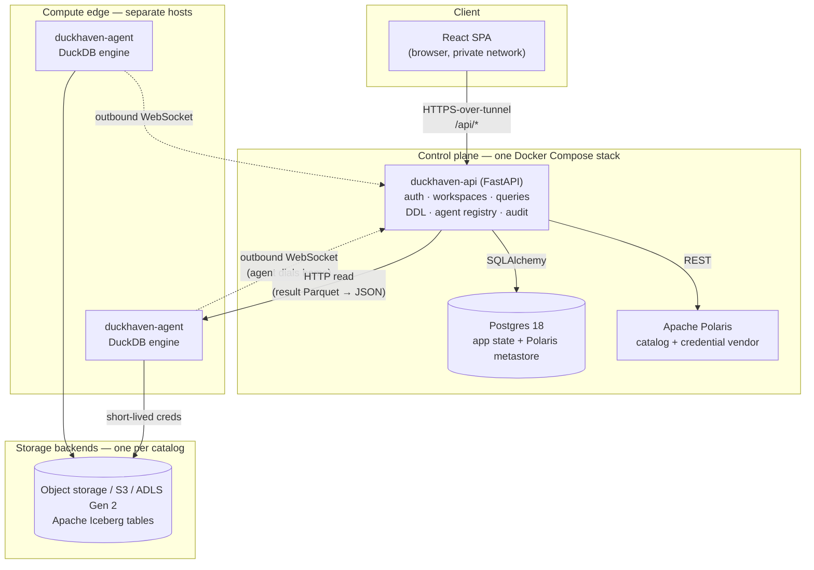
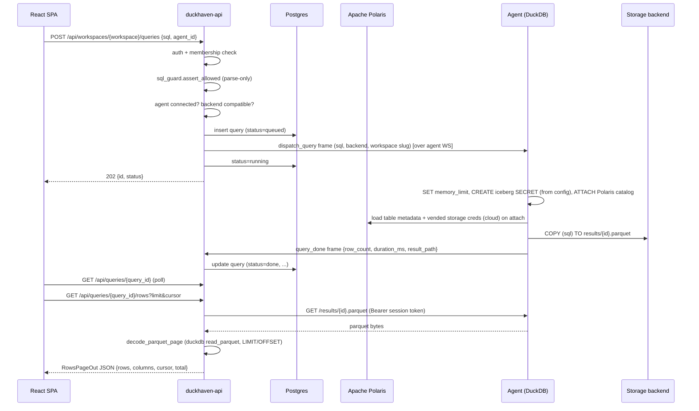
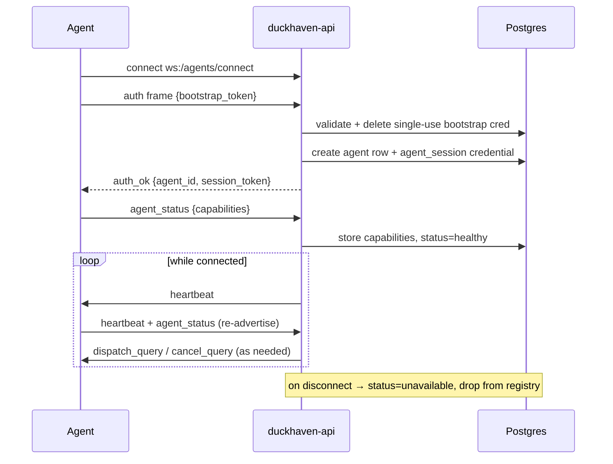

# DuckHaven — Architecture

How DuckHaven's pieces fit together and the invariants that hold them in
place. For the code itself — repository layout, the database schema, where to
make a change — see the [Codebase map](../developer/codebase-map.md).

---

## 1. Overview

DuckHaven is a **self-hosted, governed DuckDB + Iceberg analytics platform**
for small teams (2–10 users) that run [DuckDB](https://duckdb.org/) over
Apache Iceberg tables governed by [Apache Polaris](https://polaris.apache.org/).
It gives collaborative worksheets, scheduled queries, a governed catalog,
lakehouse-maintenance advice, per-workspace permissions, and a full audit
trail — without a cloud warehouse, Kubernetes, or a platform team.

Architecturally, DuckHaven is a **control plane / compute split**:

- The **control plane** (`api/`) is a single FastAPI process. It owns
  identity, workspaces, the catalog/DDL, query state, and the agent
  registry. **It never runs DuckDB queries.**
- **Compute** lives in one or more **agents** (`agent/`). Each agent embeds
  a DuckDB engine, runs on its own host, and *dials home* to the control
  plane over a WebSocket. Users pick which agent runs each query.

The result is a system that is small at the center (a Docker Compose stack
on one homelab-class box) and horizontally expandable at the edge (add an
agent host when you need more compute).

| Concern | Choice |
|---|---|
| Control plane | One `docker compose` stack: Postgres + Apache Polaris + the API |
| Compute | 1..N DuckDB **agents** on separate hosts |
| Engines | DuckDB only (heterogeneous versions allowed) |
| Storage | Apache Iceberg on Object storage (bundled MinIO) / S3 / ADLS Gen 2 (one backend per catalog) |
| Catalog & credentials | Apache Polaris — table governance + short-lived credential vending |
| Frontend | React SPA — SQL worksheets (no notebooks) |
| Network | Private only (Tailscale recommended); no public ingress |

---

## 2. Purpose & Philosophy

**Why DuckHaven exists.** Teams that love DuckDB end up sharing `.duckdb`
files over chat. DuckHaven provides a governed worksheet/collaboration
experience while keeping data on your own infrastructure, with no SaaS
lock-in and no opaque billing.

Two ideas shape nearly every design decision:

1. **DuckHaven is a dispatcher, not an optimizer.** The user picks the
   engine (agent) per worksheet. There is no distributed query planner and
   no cost-based routing. Compute is transparent and explicit.
2. **Storage is bound to the catalog, not the workspace.** Each catalog is
   bound to exactly one storage backend at a time — chosen at create time, and
   changed only through a managed [storage migration](catalogs.md#storage-migration);
   a workspace reaches storage through the catalogs it attaches (many-to-many). It
   keeps governance, credentials, and disaster-recovery reasoning simple.

### Non-goals (explicit boundaries)

- **Not a distributed-warehouse replacement.** No distributed query plan;
  agents are independent DuckDB processes with no cross-agent atomicity.
- **Not multi-engine (yet).** DuckDB only. The agent contract is drawn so a
  second engine type can be added without re-architecting the control plane.
- **Not a notebook platform.** SQL worksheets only.
- **Not internet-exposed.** The private network (Tailscale/WireGuard) is the
  security perimeter; the API speaks plain HTTP behind it.
- **Not authoritative storage and not an ingestion engine.** Source data
  lives in the backends; external tools (PyIceberg, Spark) write it.
- **No cross-workspace joins, no row/column security** in the current scope.
  Permissions are workspace-level. (DDL and destructive DML — `CREATE`/`ALTER`/
  `DROP`, `UPDATE`/`DELETE`/`MERGE` — *are* supported; see Invariant I8.)

---

## 3. High-Level Architecture



The defining structural fact: **the only long-lived connection between the
control plane and an agent is initiated *by the agent*** (the WebSocket
control channel). The control plane reaches back to an agent in exactly one
place — an HTTP `GET` to fetch the result Parquet, which the API decodes to
JSON rows. Everything else flows over the agent-initiated socket.

---

## 4. Core Architectural Principles

1. **Separation of control and compute.** The control plane orchestrates;
   agents execute. The control plane process never opens a DuckDB database
   (it uses DuckDB *only as a SQL parser* — see Invariant I1).
2. **Agents are cattle that dial home.** An agent needs only a control-plane
   URL and a bootstrap token. It registers itself, advertises its
   capabilities, and holds one socket open. The control plane keeps no
   static inventory of agent addresses.
3. **Apache Polaris is the source of truth for catalog structure.** Schemas,
   tables, columns, and table properties live in Polaris, not in Postgres. DuckHaven
   never shadows catalog *structure* in its own database — it only keeps a
   supplementary `table_metadata` sidecar for facts Polaris does not track
   (ownership, last-write provenance, row/size stats).
4. **Postgres is the single state-of-record for everything DuckHaven owns**
   (users, workspaces, queries, agents). There is no Redis or separate queue
   — query dispatch is a direct push over the agent socket.
5. **Credentials are short-lived and connection-scoped.** Polaris vends temporary
   storage credentials per catalog, as the agent attaches it; the agent applies
   them as a DuckDB `SECRET` that dies with the per-query connection.
6. **The wire contract is shared, not duplicated.** The control↔agent frame
   protocol lives in one package (`shared/`) imported by both sides, so it
   cannot drift.

---

## 5. Data Flow & Runtime Behavior

### 5.1 Query lifecycle (the primary flow)



Key properties:

- **Dispatch is a direct socket push**, not a queue. If the chosen agent is
  not connected, the request fails fast (`503`).
- **The reservation is sized before execution** (default `auto` profile). The
  agent runs `EXPLAIN` on the attached connection, estimates peak memory, and
  acquires a proportional reservation (queueing if the budget is full) — then
  reuses that same connection to execute and read the profile.
- **The execution profile is captured after the run.** The agent normalizes
  DuckDB's JSON profile (query summary + operator tree) and returns it on the
  `query_done` frame; the API persists it on `Query.profile` and serves it from
  `GET /api/queries/{query_id}/profile` for the worksheet's Profile tab. Best-effort, so a
  profiling failure never fails the query.
- **Results are materialized where they are produced** — Parquet on the
  executing agent. The control plane fetches that Parquet and decodes the
  requested page to JSON (`RowsPageOut`) with `duckdb`; `total` comes from the
  persisted `Query.row_count`. Result lifetime is bounded by the agent's
  retention sweep, so a stale query is simply re-run from its saved SQL.
- **Cancellation** sends a `cancel_query` frame; the agent calls
  `conn.interrupt()` to stop the in-flight DuckDB query.
- **A timeout** is enforced agent-side by the supervisor, also via
  `conn.interrupt()`.

### 5.2 Agent connection lifecycle



The bootstrap token is exchanged exactly once for a long-lived
`agent_session` token. That session token is what the control plane later
presents as a Bearer credential when reading result rows.

---

## 6. External Integrations

| Integration | Role | Boundary in code |
|---|---|---|
| **DuckDB** | The query engine — present *only* on agents. Also used by the control plane as a pure SQL parser. | `agent/.../executor/`, `api/.../services/sql_guard.py` |
| **Apache Polaris** | Iceberg REST catalog: metadata authority + vendor of short-lived storage credentials (via access delegation). | `api/.../services/polaris.py` |
| **Storage backends** | Where Iceberg tables physically live (all object storage): `object_store` (bundled MinIO, `httpfs`), S3 (`httpfs`), ADLS Gen 2 (`azure`). One per catalog. | `agent/.../executor/runner.py` (iceberg attach), `StorageBackend` model |
| **Postgres** | State-of-record for DuckHaven entities + the Polaris metastore. | `api/.../db/`, `models/` |
| **AI model providers (opt-in)** | Backs the AI data assistant: OpenAI, Anthropic, or Mistral SDKs via Pydantic AI, plus any OpenAI-compatible `base_url` (Ollama, vLLM, Azure OpenAI). Config-driven, disabled by default. | `api/.../services/assistant/agent.py` |
| **Tailscale (operational)** | Recommended private network providing the transport-layer security perimeter. Not a code dependency. | deployment only |

---

## 7. Deployment Architecture

**All-in-one Docker Compose stack** (`deploy/docker-compose.yml`). The six
services that make up the core stack:

```
postgres           postgres:18-alpine
minio              (object store; publishes :9000 API, :9001 console)
polaris-bootstrap  apache/polaris-admin-tool  (one-shot realm/principal; storage: S3 → MinIO)
polaris            apache/polaris             (pinned via POLARIS_IMAGE_TAG)
api                duckhaven-api    (publishes :8000, serves SPA + REST + agent WS)
agent              duckhaven-agent  (bundled compute; dials the API WS)
```

The same file also ships an observability trio — `otel-collector`, `tempo` and
`grafana` — covered in [Distributed tracing](../operations/tracing.md).

`polaris-bootstrap` is the only remaining one-shot — it provisions the Polaris
realm/principal (the admin tool ships as its own image). Everything else
self-prepares: the API's own entrypoint (`api.entrypoint`) generates the secret
key + setup token on first boot and applies migrations; the API seeds the agent bootstrap token on
startup; `minio` pre-creates the warehouse bucket in its entrypoint; Postgres
creates the dedicated `polaris` DB via an initdb script. MinIO's `:9000`
endpoint must be reachable by remote agents (the URL Polaris vends to DuckDB),
so it is published and configured via `S3_ENDPOINT` (default `http://minio:9000`
for the bundled agent). `api` is published directly on `:8000` over the private
network — there is no edge TLS terminator by default; transport security comes
from the tunnel. Images are built for `linux/amd64,linux/arm64` and published to
`ghcr.io/tamasmrtn/duckhaven-{api,agent}`.

**Additional agents — one process per host**, deployed separately against the
same control plane. An agent needs only the control-plane WebSocket URL and a
bootstrap token. It writes results and mounts under `/var/duckhaven-agent/`.

```
/var/duckhaven-agent/
  results/{query_uuid}.parquet   # materialized results (swept on a timer)
  cache/                         # optional DuckDB object-store cache
  mounts/                        # operator-configured NAS/FS mounts
```

---

## 8. Architectural Invariants

These are the rules that keep the design coherent. **A change that violates
one of these is almost certainly wrong** — if you believe you need to, raise
it explicitly rather than working around it.

- **I1 — The control plane never executes user SQL.** `api/` may construct a
  DuckDB object only to parse (`sql_guard`) and to decode a result Parquet
  file into JSON rows (`services/query.py`, a fixed `read_parquet` over bytes
  fetched from the agent). It must never `ATTACH` storage, load extensions, or
  `.execute()` user SQL. All user-query execution happens on agents. The
  scoped-grant object check (`services/grants.py`) statically extracts the
  table names a query references with `sqlglot`, a pure-Python parser — it
  opens no DuckDB connection and executes nothing.
- **I2 — Agents initiate the control connection; the control plane does
  not.** The control plane holds no static agent inventory and never dials an
  agent's control channel. Its only outbound reach to an agent is the HTTP
  result read (the API fetches the result Parquet and decodes it to JSON).
  [Elastic compute](elastic-compute.md) adds a control-plane→cloud outbound
  dependency (creating/terminating the *container* that runs an agent), which is
  not an I2 violation: the provisioned agent still dials home, and the control
  plane never opens the agent's control channel.
- **I3 — Apache Polaris owns catalog metadata; Postgres owns DuckHaven
  entities.** Never persist catalog *structure* (schemas, tables, columns) into
  Postgres or treat DuckHaven's database as a catalog cache. Postgres may hold
  a supplementary `table_metadata` sidecar — ownership, last-write provenance,
  and row/size stats that Polaris does not track — keyed by `catalog_id` + the
  Polaris schema/table name. The `catalog_grants` ACL is the same shape: rows
  keyed by `catalog_id` + schema/table *name*, an access-control list — not a
  cache of catalog structure.
- **I4 — One catalog, one storage backend at a time.** Storage is catalog-scoped:
  each catalog binds to a single backend, chosen at creation and changed only
  through a managed [storage migration](catalogs.md#storage-migration) (copy +
  path-rewrite + atomic cutover). Every table's `storage_location` derives from
  its catalog backend's `root_uri`. A workspace reaches storage through the
  catalogs it attaches (M:N).
- **I5 — The control↔agent wire format lives only in `shared/`.** Both
  `api/` and `agent/` import `duckhaven_shared`. Never define a frame type or
  payload shape independently on one side.
- **I6 — Dependency direction is one-way:** `api → shared` and
  `agent → shared`. `shared` depends on neither; `api` and `agent` never
  import each other.
- **I7 — Storage credentials are short-lived and connection-scoped.** Creds
  are vended per catalog on `ATTACH`, applied as a DuckDB `SECRET` on the
  per-query connection, and never written to disk on the agent.
- **I8 — Data + catalog DDL reach an agent; sandbox escapes do not.**
  `sql_guard` allows `SELECT`/`INSERT`/`UPDATE`/`DELETE`/`MERGE` and
  `CREATE`/`ALTER`/`DROP`, executed on the agent against the attached Polaris
  REST catalog, and rejects anything that could break out of the per-query
  sandbox (`ATTACH`/`DETACH`, `COPY`/`EXPORT`, `INSTALL`/`LOAD`, `SET`/`PRAGMA`,
  `CALL`, `VACUUM`, transaction control). Only a single `SELECT` is materialized
  to Parquet; other statements run directly and return no result grid. Structured
  catalog DDL (create/drop schema, create/drop table) is **also** exposed as REST
  endpoints driving the catalog UI; ALTER from the UI is generated as SQL and run
  through the query path. The opt-in [SQL session layer](sql-sessions.md) relaxes
  this allowlist to a **capability-scoped per-statement policy** (admitting a safe
  `SET` subset, `COPY` to the session's staging prefix, and `ATTACH` of the managed
  catalog) — still enforced at the API, per statement, never on the agent.
- **I9 — Postgres is the only state-of-record.** No second source of truth
  (no Redis, no in-memory queue surviving a restart). The in-memory agent
  registry is an ephemeral index of live sockets, not state.
- **I10 — Authorization happens at the API boundary** via
  `assert_workspace_member` before any dispatch. Polaris grants are
  defense-in-depth, not the primary gate. When a catalog attachment is in
  `access_mode="scoped"`, `services/grants.py` extends this same boundary with
  catalog/schema/table grants — enforced DuckHaven-side, still never delegated
  to Polaris.

---

## 9. Glossary

| Term | Meaning |
|---|---|
| **Control plane** | The `duckhaven-api` process (with Postgres + Polaris). Orchestrates; never runs DuckDB queries. |
| **Agent** | A `duckhaven-agent` process embedding DuckDB, running on its own host, dialing home over WebSocket. The unit of compute. |
| **Workspace** | A governance + collaboration boundary. Attaches one or more catalogs (M:N); one is the default. |
| **Catalog** | A decoupled data domain: its own Apache Polaris catalog + storage backend, attachable to many workspaces. |
| **Storage backend** | A physical location for Iceberg tables (Object storage, S3, ADLS Gen 2), registered once and referenced by catalogs. |
| **Catalog-managed table** | An Iceberg table whose commits are arbitrated by Apache Polaris (every Polaris REST table is catalog-managed). |
| **Bootstrap token** | A single-use credential an operator generates so a new agent can register. Exchanged once for a long-lived agent session token. |
| **Capabilities** | The document an agent advertises (DuckDB version, loaded extensions, memory ceiling) used to match agents to the backends a workspace's catalogs use. |
| **Frame** | One JSON message on the control WebSocket: `{type, payload}`, defined in `duckhaven-shared`. |
| **SQL session** | An agent-held, persistent DuckDB connection the API brokers for an external client so it can run many statements with connection-scoped state. Off by default; see [SQL sessions](sql-sessions.md). |
| **Vended credentials** | Short-lived storage credentials minted by Apache Polaris per catalog and applied as a connection-scoped DuckDB `SECRET`. |
