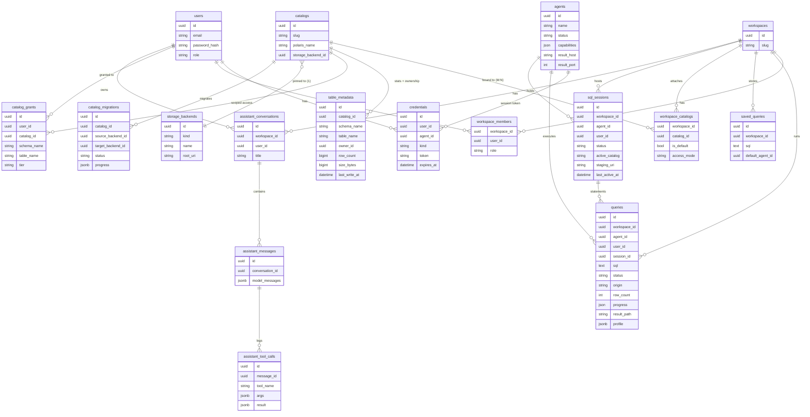

# Codebase map

Where everything lives and where to make a change. Written to be read in one
sitting by a new contributor — or a coding agent — before touching the code.

It describes *stable structure*, not progress: for what the system is and why,
see [Architecture](../concepts/architecture.md); for roadmap and milestone
status see the [README](https://github.com/tamasmrtn/duckhaven#roadmap) and the
issue tracker. Invariant references below (I1, I2, …) are numbered as in
[Architectural invariants](../concepts/architecture.md#8-architectural-invariants).

---

## 1. Repository Structure

DuckHaven is a polyglot monorepo: a `uv` Python workspace (`api`, `agent`,
`shared`) plus an npm React app (`web`).

```
duckhaven/
├── api/          FastAPI control plane (the "brain")
├── agent/        DuckDB compute agent (the "muscle")
├── shared/       duckhaven-shared: the control↔agent wire contract
├── web/          React SPA (SQL worksheets, catalog, admin)
├── deploy/       Docker Compose stack, entrypoints, secrets bootstrap
├── scripts/      Operator helpers (pg backup, token generation)
├── docs/         This file + development, runbook, self-hosting guides
├── Makefile      Canonical dev/test/lint/migrate/compose commands
└── pyproject.toml  uv workspace root (members: api, agent, shared)
```

Each Python package owns its own `pyproject.toml`. `api` and `agent` both
declare `duckhaven-shared = { workspace = true }`. The dependency direction
is strict: **`api` and `agent` depend on `shared`; nothing depends on `api`
or `agent`** (Invariant I6).

---

## 2. Code Map

This is the navigation core. For each package: what it is for, how its
internals are organized, and the files to open first.

### 2.1 `shared/` — `duckhaven_shared` (the contract)

**Purpose.** The single source of truth for the control-plane ↔ agent wire
format. Tiny by design (only depends on `pydantic`).

| Module | Defines |
|---|---|
| `protocol.py` | `FrameType` (string enum) and `Frame` (`{type, payload}`) — every message on the control WebSocket |
| `schemas.py` | `AgentCapabilities` — the document an agent advertises (DuckDB version, loaded extensions, memory ceiling, cores, host) |

`FrameType` values: `auth`, `auth_ok`, `dispatch_query`, `query_progress`,
`query_done`, `cancel_query`, `heartbeat`, `agent_status`, `metrics_sample`,
`set_concurrency`, and the SQL-session frames `open_session`, `session_opened`,
`exec_statement`, `close_session`, `session_closed`. **Adding or changing a
frame means editing this package** — both sides pick it up by import, which is
how the contract stays in sync (Invariant I5).

### 2.2 `api/` — `duckhaven-api` (control plane)

**Purpose.** Everything the browser talks to, plus the agent-facing
WebSocket. A FastAPI app backed by async SQLAlchemy + Postgres.

**App composition** (`src/api/main.py`) — important to understand the URL
surface:

- An **outer** ASGI app mounts three things:
   - the **agent WebSocket** at `/agents/connect` (root level — agents dial here),
   - the **REST API** sub-app under **`/api`** (shares an origin with the SPA),
   - the **built SPA** as static files at `/` (only present in the image; a
     catch-all serves `index.html` so client-side routes deep-link).
- The REST sub-app owns a lifespan that constructs the shared `PolarisClient`
  (held on `app.state`).

**Internal layout:**

| Directory | Responsibility |
|---|---|
| `routers/` | HTTP/WS endpoints. One module per resource: `auth`, `workspaces`, `catalogs` (attach/detach + storage-backend migration control), `schemas` (catalog DDL + table sample), `queries`, `agents`, `grants` (scoped access-grant admin API), `assistant` (SSE chat + write-approval), `health`, `setup`, plus `agents_ws` (the agent WebSocket) and `admin/` (`agents`, `storage`, `users`, `maintenance`, `service_accounts`). |
| `services/` | Business logic, framework-free. The interesting code lives here (see below). |
| `models/` | SQLAlchemy ORM models = the Postgres schema. |
| `schemas/` | Pydantic request/response DTOs (distinct from ORM models). |
| `db/` | Engine/session setup (`session.py`) and the declarative `Base`. |
| `deps.py` | FastAPI dependencies: `get_db`, `get_current_user` (session cookie **or** PAT bearer token), `get_polaris_client`. |
| `config.py` | `pydantic-settings` config (DB URL, Polaris URL + client credentials, cookie/secret settings). |
| `alembic/` | Database migrations. Applied automatically by the container entrypoint in production. |

**Key services to know:**

| Service | What it does | Interacts with |
|---|---|---|
| `services/query.py` | Dispatches a query to an agent over the registry socket; handles `query_progress`/`query_done` frames coming back; fetches the result Parquet from the agent and decodes it to JSON rows (`decode_parquet_page`); also drives the synchronous table-sample preview and persists agent-reported table stats. **The heart of the system.** | `agent_registry`, the `Query`/`TableMetadata` models |
| `services/agent_registry.py` | In-memory `ConnectionManager` (`registry`) mapping `agent_id → live WebSocket`. The only place that knows which agents are connected *right now*. | `routers/agents_ws.py`, `services/query.py` |
| `services/polaris.py` | Async client for Polaris: catalogs (management API) + namespaces/tables (Iceberg REST), with OAuth2 client-credentials auth. Speaks REST directly via `httpx`. | Polaris container |
| `services/sql_guard.py` | The SQL allowlist for the one-shot query path. Uses `duckdb.extract_statements` to **parse only** and allow data + catalog DDL statements (`SELECT`/`INSERT`/`UPDATE`/`DELETE`/`MERGE`/`CREATE`/`ALTER`/`DROP`), rejecting sandbox-escaping ones (`ATTACH`, `COPY`, `LOAD`, `SET`, …). No connection, no execution. | `routers/queries.py` |
| `services/statement_policy.py` | The capability-scoped policy for the **SQL session** path (relaxes the allowlist). A `sqlglot` AST classifier that admits a safe `SET` subset, `COPY`/`read_*` confined to the session's staging prefix, and `ATTACH` of the managed catalog, rejecting everything else fail-closed. Runs at the API, per statement. | `routers/sql_sessions.py` |
| `services/sql_sessions/` | SQL session brokering (package): dispatches `open_session`/`exec_statement`/`close_session` frames, applies the agent's lifecycle acks, reconciles sessions on agent disconnect, and runs a leader-elected idle/max-lifetime reaper. | `routers/sql_sessions.py`, `routers/agents_ws.py`, the `SqlSession`/`Query` models |
| `services/session_credentials.py` | The per-session credential-vending seam: supplies the Polaris connection block placed in `open_session` (the API is the vendor, not the agent's static config) and computes a session's scoped `staging_uri`. | `services/sql_sessions/`, `routers/sql_sessions.py` |
| `services/agent_capabilities.py` | Maps a backend kind to its required DuckDB extension and checks an agent's advertised capabilities at dispatch time. | `routers/queries.py` |
| `services/workspace.py` | Membership/role checks (`assert_workspace_member`), workspace lookup, lazy Polaris catalog creation (`ensure_polaris_catalog`), backend→storage mapping (`polaris_storage`). | Polaris, the `Workspace`/`WorkspaceMember` models |
| `services/auth.py` | bcrypt password hashing/verification and session-cookie handling. | `routers/auth.py`, `routers/setup.py` |
| `services/grants.py` | Scoped-access grant resolution: walks the `table → schema → catalog` hierarchy (inherits downward, including future tables), additive/no-deny, effective tier capped at the workspace role. Extracts referenced objects from SQL via `sqlglot`. | `routers/schemas.py` (browsing filter/404), `services/query.py::dispatch_query` (per-table enforcement), `routers/grants.py` (admin API) |
| `services/assistant/` | The governed AI data assistant (package, not a single module). Thin tools that are authenticated loopback calls to DuckHaven's own REST API (`httpx` + `ASGITransport`) so authorization never leaves the normal API boundary; wraps them in a governance/audit capability; mints an ephemeral per-turn PAT as the assistant's identity; persists conversation state to Postgres; runs turns via Pydantic AI with human-in-the-loop write approval. | `routers/assistant.py`, the loopback REST API, Pydantic AI, `services/grants.py`/`sql_guard.py` (via the loopback) |
| `services/migration/` | The catalog storage-backend migration engine (package): a `pending → copying → verifying → cutover → completed` state machine run by a leader-elected background loop (Postgres advisory lock). Provisions a shadow Polaris catalog at the target backend, copies/rewrites Iceberg files, verifies snapshot counts, then atomically re-points the catalog row at cutover; all progress is checkpointed so a crash resumes from the last completed table. | `routers/catalogs.py`, Polaris, the storage backends |

### 2.3 `agent/` — `duckhaven-agent` (compute)

**Purpose.** Embed a DuckDB engine, execute dispatched queries, and serve
result files. An agent is a single Python process running three concurrent
tasks (`src/agent/main.py` gathers them):

1. **Control channel** (`control/channel.py`) — opens the outbound WebSocket,
   authenticates, advertises `AgentCapabilities`, then loops handling frames
   (`dispatch_query`, `cancel_query`, `heartbeat`, `set_concurrency`, and the
   SQL-session frames `open_session`/`exec_statement`/`close_session`). Reconnects
   with backoff if the socket drops. On each heartbeat it re-advertises
   capabilities; each `metrics_sample` also carries the live running/queued query
   counts, active concurrency profile, and held-session count. Held SQL-session
   connections live in `control/session.py` (a `session_id → DuckDBPyConnection`
   registry, cleared on every reconnect), each holding an admission slot for its
   lifetime; a statement runs on its held connection via `run_statement_sync`.
2. **Result server** (`results/server.py`) — an HTTP server bound to
   `RESULTS_HTTP_HOST` (`0.0.0.0` in compose) that advertises its port to the
   control plane, serving `results/{query_id}.parquet` with **HTTP `Range`**
   support, gated
   by a Bearer token (the agent's session token, held in `auth.py:TokenHolder`).
3. **Retention sweep** (`results/retention.py`) — periodically deletes result
   Parquet files older than the retention window.

**Query execution** is split for testability and cancellation:

| Module | Responsibility |
|---|---|
| `executor/admission.py` | `Admission`: memory-budget admission control with a FIFO queue. The cgroup-aware budget (`effective_memory_bytes() × (1 − headroom)`) is split into a weighted slot ladder (profiles in `duckhaven_shared.concurrency`); a new query takes the largest free slot, the rest queue. In the default `auto` profile it instead admits a per-query *requested* reservation (sized from the estimate) clamped to `[floor, ceiling×budget]`. Enforces the invariant `Σ running memory_limit ≤ budget` so the agent never OOM-kills. Exposes live running/queued counts and the active profile, switchable at runtime via the `set_concurrency` frame. |
| `executor/plan.py` | Shared DuckDB plan/profile tree-walker: one recursive walker, two extractors. `parse_explain` reads estimated cardinality from `EXPLAIN (FORMAT json)` (pre-execution); `parse_profile` reads actual per-operator metrics + a query-level summary from the JSON profile (post-execution). Consumed by both the estimator and the profiler. |
| `executor/estimator.py` | `estimate_memory_bytes`: runs `EXPLAIN` on the attached connection and approximates peak memory as `Σ` over blocking operators (joins, group-bys, sorts) of `estimated_cardinality × row_width × safety`; `bucket_for` snaps it to a T-shirt bucket of the budget. Best-effort — returns `None` (caller uses the fallback bucket) on any failure. |
| `executor/runner.py` | `run_query_sync`: the synchronous DuckDB path. Sets `memory_limit`/`threads` to the slice the admission manager granted, loads `iceberg` (+ `httpfs`/`azure` for cloud), creates a connection-scoped iceberg OAuth2 `SECRET` from agent config and `ATTACH`es the workspace's Polaris catalog (warehouse = workspace slug; `vended_credentials` for every backend, since all are object storage), then `COPY (sql) TO '<uuid>.parquet'`. Around execution it enables DuckDB JSON profiling and normalizes the result into `stats["profile"]` (best-effort; the `auto` path reuses the connection it ran `EXPLAIN` on). When the dispatch carries `stats_for`, it also returns the target table's `COUNT(*)` for the catalog sidecar. |
| `executor/supervisor.py` | `run_query`: runs `run_query_sync` on a thread executor with a wall-clock timeout. Uses DuckDB's thread-safe `conn.interrupt()` (via `loop.call_later` and on cancel) to actually stop a running query. |

`config.py` holds the operator timeout ceiling (`max_timeout_s`, per-query
requests clamp to it), the admission knobs (`max_concurrency_profile` — default
`auto` — `memory_headroom_fraction`, `max_queue_depth`, `queued_timeout_s`), the
estimator knobs (`estimate_safety_multiplier`, `estimate_floor_bytes`,
`estimate_ceiling_fraction`, `explain_timeout_s`, `estimate_fallback_bucket`),
and the profiling kill-switch (`profiling_enabled`, default on).

### 2.4 `web/` — the React SPA

**Purpose.** The worksheet UI and admin console. React 19 + Vite, TanStack
Router/Query/Table, Monaco editor, Radix + shadcn/ui + Tailwind.

**Layered by responsibility** (open in this order to trace a feature):

| Directory | Responsibility |
|---|---|
| `src/api/` | Thin `fetch` wrappers. `client.ts` prefixes every call with `/api` and sends cookies; one module per resource. |
| `src/queries/` | TanStack Query hooks (`useX` query/mutation) wrapping `src/api/`. The data-fetching seam components consume. |
| `src/features/` | Page-level features: `worksheet/`, `catalog/`, `saved-queries/`, `history/`, `auth/`, `admin/`. |
| `src/components/app/` | App-shell chrome (`AppShell`, `TopBar`, `LeftRail`, `AgentPicker`, `WorkspaceSwitcher`, `CommandPalette`). |
| `src/components/ui/` | shadcn/ui primitives. |
| `src/router.tsx` | TanStack route tree. Authed routes nest under `/$ws/...` (`worksheets`, `catalog`, `saved-queries`, `history`, `queries/$queryId` (the dedicated query-profile graph), `admin/*`). |
| `src/types/` | Shared TypeScript types mirroring the API DTOs. |
| `src/mock/` | MSW handlers + fixtures used in `dev` (and tests) when the real API is absent. |

The frontend's `AgentPicker` runs the same backend-compatibility check the
control plane enforces server-side, so incompatible agents are visibly
disabled before a query is even sent.

### 2.5 `deploy/` & `scripts/`

`deploy/docker-compose.yml` defines the all-in-one stack:
`postgres` → `polaris-bootstrap` (one-shot schema + root principal) →
`polaris` → `api` → `agent`, plus `minio` for object storage.
The API's own entrypoint (`api/src/api/entrypoint.py`) generates the first-boot
secrets (including the one-shot admin setup token), runs Alembic migrations,
then starts uvicorn; the API
also seeds the agent bootstrap token on startup. `minio` pre-creates the
warehouse bucket in its own entrypoint. Remote agents can still be deployed
per host against the same control plane. `scripts/` holds operator helpers
(`pg-backup.sh`, `gen-token.sh`).

---

## 3. Data Model

DuckHaven splits its state across two stores, and the split is itself an
invariant (I3): **DuckHaven's own entities live in Postgres; catalog
metadata lives in Apache Polaris.**

### Postgres (owned by `api/src/api/models/`)



Notes that matter for changes:

- **`credentials` is polymorphic** by `kind`: user `session`, user `pat`
  (a bearer-token Personal Access Token, hashed with SHA-256 for O(1)
  lookup-by-hash, operator-chosen expiry), agent `agent_bootstrap`
  (single-use), and agent `agent_session` (long-lived).
- **`workspace_catalogs.access_mode`** is `open` (today's default — the
  workspace role applies uniformly) or `scoped` (per-principal
  `catalog_grants` narrow access below the workspace role; see
  [Permissions](../concepts/permissions.md)).
- **`catalog_migrations`** tracks a storage-backend migration's state machine
  (`pending → copying → verifying → cutover → completed`) plus per-table and
  event-log detail tables (checkpointed so a crash resumes from the last
  completed table); see `services/migration/`.
- **`assistant_conversations`/`assistant_messages`/`assistant_tool_calls`**
  persist the AI assistant's chat history: one conversation per worksheet
  session, its messages serialized via Pydantic AI's
  `ModelMessagesTypeAdapter`, and each tool invocation logged for audit; see
  `services/assistant/`.
- **`agents.capabilities`** is the last advertised `AgentCapabilities` JSON;
  `result_host`/`result_port` tell the API where to fetch the result Parquet.
- **`queries` is also the audit log** — there is no separate audit table.
  `GET /workspaces/{workspace}/queries` reads rows straight from `queries`, excluding
  internal rows (`origin = "sample"`, used by the table-sample preview). It is
  workspace-scoped for members; an admin may pass `all_workspaces` (and the
  `user_id`/`agent_id`/`since`/`until` filters) for the cross-workspace audit view.
- **`sql_sessions` is the state-of-record for the [SQL session layer](../concepts/sql-sessions.md)**
  (I9) — the agent's held connection is ephemeral socket state. A row pins one
  `agent_id` (every statement routes there), records the requesting `user_id` for
  per-statement authorization, the scoped `staging_uri`, and the timestamps the
  idle-reaper uses. Session statements are ordinary `queries` rows tagged with
  `session_id` (`origin = "session"`), so they reuse the poll/fetch/audit pipeline.
- **Catalogs are decoupled (M:N).** `catalogs` is a first-class entity (own
  Polaris catalog + storage backend); `workspace_catalogs` binds catalogs to
  workspaces many-to-many, with exactly one `is_default` per workspace. Storage
  is catalog-scoped — a backend cannot be deleted while any catalog references it.
- **`table_metadata` is the catalog sidecar** — keyed by `catalog_id` (the table's
  true home; a shared catalog has one ownership/stats row). It holds what Polaris
  does not track: `owner_id`, `last_write_*`, and agent-computed
  `row_count`/`size_bytes`. Populated on table create and on sample/stats
  completion; merged into `TableOut` by `routers/schemas.py`. Polaris remains the
  source of truth for catalog structure. (Maintenance health rows keep a
  denormalized `workspace_id` alongside `catalog_id` so the workspace health page
  reads without a join.)

### Apache Polaris (owned by Polaris, addressed via `services/polaris.py`)

One **Polaris catalog per DuckHaven catalog** (named by `catalogs.polaris_name`;
migrated catalogs keep the originating workspace slug, so no Polaris catalog is
renamed), containing namespaces (schemas) and tables. A workspace's query attaches
**all** of its bound catalogs (multi-attach), each under its slug alias, and `USE`s
the active one. The default namespace is **`analytics`**, not `main`: `main` is
DuckDB's built-in default schema in an attached catalog and shadows the Iceberg
namespace, so `catalog.main.table` won't resolve. Every DuckHaven-created table is
Apache **Iceberg** format and catalog-managed by definition; its location sits under
the catalog's base location, derived from the catalog backend's `root_uri`. Catalogs
are created **fully DuckHaven-owned**:
`ensure_catalog_access` grants the service principal the full catalog-management
set (`CATALOG_MANAGE_CONTENT` + `CATALOG_MANAGE_METADATA` + `CATALOG_MANAGE_ACCESS`),
and `create_catalog` enables `polaris.config.drop-with-purge.enabled` so `DROP`
reclaims data files — without the content grant Polaris returns 403 on table data
access. REST-created tables record a `table_metadata` owner sidecar at create time;
tables created via SQL DDL get one lazily (stats on sample). A table's **Iceberg
snapshot history** (the catalog History tab) is read **live** off the
`loadTable` metadata via `list_snapshots` — never persisted to Postgres — and a
"query at this snapshot" worksheet pins the read with DuckDB's `AT (VERSION => …)`
/ `AT (TIMESTAMP => …)` time-travel clause (there is no `BEFORE`; the UI says
"as of"). The agent's DuckDB
sets the working catalog with `USE <catalog>.<schema>`
(a bare `USE <catalog>` does not resolve the attached REST catalog). Polaris
vends short-lived, scoped storage credentials to DuckDB on attach via access
delegation (`ACCESS_DELEGATION_MODE 'vended_credentials'`).

**Storage policy — object storage only (MinIO bundled).** Every workspace
catalog is backed by **S3-compatible object storage**; there is no Polaris FILE
storage. This is forced by DuckHaven's control-plane/compute-split topology:
DuckDB can only read **and write** Iceberg tables through the REST catalog when
storage is S3-compatible, because Polaris must vend scoped credentials the
remote agent uses. FILE storage cannot support writes across the
Polaris-container / remote-agent boundary (Polaris creates table directories as
its container user; the agent gets permission denied), so it was removed. The
compose stack therefore **bundles MinIO**, and the `object_store` backend
kind is physically backed by a MinIO bucket: its catalogs use
`storageType = S3` pointed at MinIO (with the catalog's vended `endpoint` set to
an externally-reachable URL the agent can reach, and an internal endpoint for
Polaris itself). Per-workspace isolation comes from a `/{slug}` prefix under the
shared bucket. The `s3`/`adls_gen2` kinds remain operator-owned external object
stores.

---

## 4. Common Change Scenarios

A quick "if you want to do X, start here" index for contributors and agents.

| You want to… | Start in | Also touch |
|---|---|---|
| Add a control↔agent message | `shared/.../protocol.py` (new `FrameType`) | sender + handler in `api/.../routers/agents_ws.py` / `services/query.py` and `agent/.../control/channel.py` |
| Add a REST endpoint | `api/.../routers/<resource>.py` | a `schemas/` DTO, register in `main.py`, a test under `api/tests/unit/routers/`, and the web `src/api/` + `src/queries/` |
| Add/alter a Postgres table | `api/.../models/` | a new migration in `api/alembic/versions/` (`make migrate-new name=...`) |
| Change query execution (extensions, pragmas, attach) | `agent/.../executor/runner.py` | `supervisor.py` if it affects timeout/cancel |
| Widen/narrow the SQL allowlist | `api/.../services/sql_guard.py` | its test in `tests/unit/services/test_sql_guard.py`; the runner's single-`SELECT` branch in `agent/.../executor/runner.py` |
| Change the SQL-session statement policy | `api/.../services/statement_policy.py` | its test in `tests/unit/services/test_statement_policy.py`; `routers/sql_sessions.py` (where it is enforced) |
| Add a catalog DDL UI action | `api/.../routers/schemas.py` (REST endpoint) + `services/polaris.py` | web `src/features/catalog/CatalogNodeMenu.tsx` (+ dialogs), `src/api/schemas.ts`, `src/queries/schemas.mutations.ts`, MSW handler, tests |
| Add a storage backend kind | `api/.../services/agent_capabilities.py` (required extension) + `services/workspace.py` (`polaris_storage`) | `agent/.../executor/runner.py` (iceberg attach), `StorageBackend` validation, web `StorageIcon`/wizard |
| Change catalog credentials | `agent/.../config.py` + `api/.../config.py` (Polaris client id/secret) | `agent/.../executor/runner.py` (iceberg `SECRET`) |
| Add a UI screen | `web/src/features/<feature>/` | `src/router.tsx`, `src/api/` + `src/queries/`, MSW handler in `src/mock/handlers/`, a test under `web/tests/` |
| Change scoped-access grant resolution or enforcement | `api/.../services/grants.py` | `routers/schemas.py` (browsing), `services/query.py::dispatch_query` (SQL), `routers/grants.py` (admin API), tests under `api/tests/unit/` |
| Change the agent handshake/auth | `api/.../routers/agents_ws.py` + `api/.../routers/admin/agents.py` | `agent/.../control/channel.py`, `agent/.../auth.py` |

Per project convention, **every change ships with tests** (pytest for
`api`/`agent`, Vitest + RTL + MSW for `web`) and passes
`make test && pre-commit run --all-files`.

---

## 5. Known Technical Debt

Honest, stable-enough caveats. The live, itemized list lives in the issue
tracker and the [README roadmap](https://github.com/tamasmrtn/duckhaven#roadmap); this section names
the *categories* a contributor should be aware of.

- **External cloud-backend storage config.** The `s3`/`adls_gen2` kinds
  (operator-owned external object stores) still need their Polaris
  `storageConfigInfo` credential wiring (role ARN / tenant) completed in
  `services/workspace.polaris_storage`. Their write paths are validated behind
  opt-in/env-gated integration tests. The bundled-MinIO `object_store` path
  is fully wired (see §7).
- **DuckDB-iceberg DDL coverage.** `DROP` now purges (catalogs enable
  drop-with-purge and grant full ownership), but the breadth of `CREATE`/`ALTER`
  support against the Polaris REST catalog is bounded by the DuckDB `iceberg`
  extension version on the agent. The UI Alter flow generates SQL run through the
  agent, so any unsupported op surfaces as a query error rather than a silent
  no-op.
- **Control-plane HA is opt-in.** The default deploy is single-node (Postgres +
  Polaris + API on one host) for simplicity, and that is what most installs run.
  A highly-available topology — HA Postgres plus multiple API replicas behind a
  load balancer — is now supported via a separate compose file; see
  [High availability](../deployment/high-availability.md). It is not the default,
  so a single-node install carries the usual single-box failure domain until you
  opt in.
- **Result durability.** Results live only on the executing agent until the
  retention sweep removes them; they are not replicated. The recovery story
  is "re-run from saved SQL," not "fetch the old result."
- **Progress reporting is coarse.** `query_progress` frames are persisted to
  `queries.progress`, but the UI surfaces a binary running/done rather than
  streaming progress.

---
