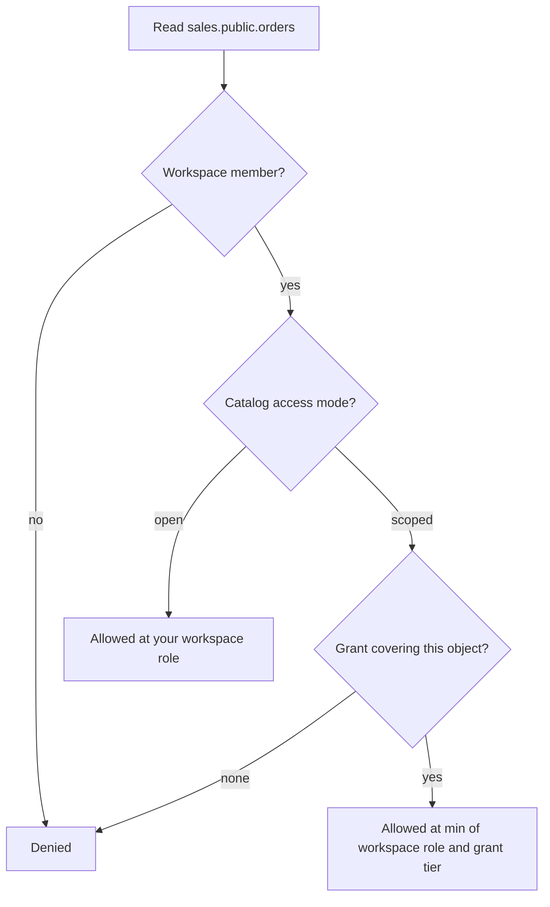

# How access works

DuckHaven decides what you can do in **three independent layers**. A request passes
through each layer that applies to it, and is allowed only if it clears them all.
Understanding the three — and how they combine — is the key to reasoning about "who
can see what."

| Layer | The question it answers | Values | Scope |
|---|---|---|---|
| **1 · Global role** | What can you *administer*? | `admin`, `user` | The whole deployment |
| **2 · Workspace role** | Which workspaces can you enter, and what can you do inside them? | `reader`, `writer`, `owner` | One workspace |
| **3 · Data grants** *(opt-in)* | Inside a *scoped* catalog, which exact objects can you see and read? | `metadata`, `reader`, `writer` — on a catalog, schema, or table | One principal × one object |

!!! note "The layers are independent"
    A global **admin** cannot automatically read your data, and a workspace **owner**
    is not automatically an admin. Touching data always requires workspace membership
    (layer 2); administering the platform always requires a global role (layer 1).

## Layer 1 — Global role: what you can administer

Every account has one **global role**, `admin` or `user`. This layer is about
*operating DuckHaven* — managing agents, storage backends, users, and catalog
settings — **not** about reading data. A brand-new admin sees no tables until they are
added to a workspace; a plain `user` is a normal account with no administrative
powers. See [Identity & permissions](../concepts/permissions.md#global-roles-permissions)
for the full permission list.

## Layer 2 — Workspace role: your access to a workspace's data

A [workspace](../concepts/workspaces.md) bundles the catalogs a team works with. To
touch any data you must be a **member** of the workspace, with one role:

| Role | Can do |
|---|---|
| `reader` | Browse schemas and tables; run queries; view history |
| `writer` | Everything a reader can, plus create/modify/drop tables and run DDL |
| `owner` | Everything a writer can, plus manage workspace membership |

By default, this role is your access to **every** schema and table in **every** catalog
the workspace attaches. For most teams, layers 1 and 2 are all they ever configure —
add people to a workspace, pick a role, done. See
[Manage users & access](users-access.md) for how to do it.

## Layer 3 — Data grants: fine-grained and opt-in

When a workspace role is too coarse — "this analyst should see `marketing` but not
`finance`," or "this coding agent may *discover* a table but never read its rows" —
you switch a catalog attachment from **`open`** (the default) to **`scoped`**.

In a scoped catalog the workspace role is no longer enough on its own: a member sees
only the objects they are **granted**, and each grant carries a **tier**.

| Tier | Grants |
|---|---|
| `metadata` | Discover and describe the object (list it, read its columns) — but **not** its rows |
| `reader` | Everything `metadata` can, plus read rows (query and sample) |
| `writer` | Everything `reader` can, plus write and run DDL |

Grants sit at the **catalog**, **schema**, or **table** level and inherit downward — a
schema grant covers every current and future table in it. They only ever **narrow** the
workspace role, never widen it. Manage them from the catalog view (right-click a
catalog, schema, or table → **Permissions**). The complete model — inheritance,
conflict resolution, and what is deliberately *out* of scope (no row- or column-level
security, no groups) — is in
[Identity & permissions › Scoped access](../concepts/permissions.md#scoped-access).

## How the layers combine

To decide whether someone may read a specific table, DuckHaven walks the layers in
order:

1. **Not a member of the workspace?** → denied. (A global admin is no exception.)
2. **Member, and the catalog is `open`?** → allowed at your **workspace role**.
3. **Member, and the catalog is `scoped`?** → allowed at **the lower of** your workspace
   role and the best grant tier covering that object; with **no** covering grant, denied.

The same walk runs for **every** object a request touches: a query that joins two
tables must clear the check for both, and browsing filters the tree to what you can at
least discover.

## A worked example

Dana is a data analyst:

- **Layer 1** — global role `user`, so she cannot open the Admin area.
- **Layer 2** — in workspace `dev` she is a `writer`.
- **Layer 3** — `dev` attaches two catalogs. `marketing` is left **open**; `sales` is
  **scoped**, and Dana has a `reader` grant on `sales.public.orders`.

What Dana can do:

| Action | Allowed? | Which layer decided it |
|---|---|---|
| Open **Admin → Users** | No | Layer 1 — she is a `user`, not `admin` |
| Query any table in `marketing` | Yes, as writer | Layer 2 — `marketing` is open, so her `writer` role applies |
| Query `sales.public.orders` | Yes, read-only | Layer 3 — her `reader` grant |
| `INSERT` into `sales.public.orders` | No | Layer 3 — the `reader` grant caps her below her `writer` role |
| Even see `sales.finance.*` | No — it isn't listed | Layer 3 — no grant, so scoped browsing hides it |

Notice how layer 3 **narrowed** Dana: she is a workspace `writer`, but on `orders` she
is only a reader, and `finance` is invisible to her entirely.

## Which layer do I change?

| You want to… | Change | Where |
|---|---|---|
| Let someone manage agents, storage, or users | Layer 1 (global role) | Admin → Users |
| Give someone access to a workspace's data | Layer 2 (workspace role) | Admin → Users → Manage workspaces, or a workspace owner adds them |
| Restrict access to specific schemas or tables | Layer 3 (data grants) | Catalog view → right-click → Permissions (the catalog must be in **scoped** mode) |

## Related

- [Manage users & access](users-access.md) — the how-to for layers 1 and 2.
- [Identity & permissions](../concepts/permissions.md) — the full authorization model,
  including how grants resolve and what is out of scope.
- [Service accounts & tokens](service-accounts.md) — non-human principals get the same
  three layers.
